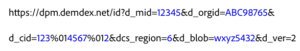

# Integración directa con el servicio de servicio de identidad de Experience Cloud {#direct-integration-with-the-experience-cloud-id-service}

Esta implementación permite a los clientes utilizar el servicio de ID en dispositivos que no pueden aceptar ni trabajar con nuestro código JavaScript o SDK. Esto incluye dispositivos, como las consolas de videojuegos, los televisores inteligentes u otras aplicaciones compatibles con Internet. Consulte esta sección para obtener información sobre sintaxis, ejemplos de código y definiciones.

## Sintaxis {#section-a4754afec5ad40b6be00d6f1011d68bb}

Los dispositivos que no pueden utilizar las bibliotecas de códigos VisitorAPI.js o SDK pueden hacer llamadas directamente a los servidores de recopilación (DCS) utilizados por el servicio de ID. Para ello, llamaría a `dpm.demdex.net` y daría formato a su solicitud, tal como se muestra a continuación. La letra en *cursiva* indica un marcador de posición de variable.


En este ejemplo de sintaxis, el `d_` prefijo identifica los pares clave-valor de la llamada como una variable de nivel del sistema. Puede pasar bastantes `d_` parámetros al servicio de ID, pero céntrese en los pares clave-valor, tal como se muestra en el código de más arriba. Para obtener más información sobre otras variables, consulte [Atributos admitidos para las llamadas API de DCS ](https://marketing.adobe.com/resources/help/en_US/aam/dcs-keys.html).

El servicio de ID admite las llamadas de HTTP y HTTPS. Utilice HTTPS para pasar datos desde una página segura.

## Solicitud de ejemplo {#section-26302b8851704888b6f8e6b2071bcdb0}

Su solicitud puede asemejarse al ejemplo que se muestra a continuación. Se han reducido las variables largas.



## Respuesta de ejemplo {#section-89bc103b3e9e4a8b98e74c32897b1200}

El servicio de ID devuelve datos en un objeto JSON, tal como se muestra a continuación. Su respuesta puede ser distinta.

```js
{
     "d_mid":"12345",
     "dcs_region":"6",
     "id_sync_ttl":"604800",
     "d_blob":"wxyz5432"
}
```

## Parámetros de solicitud y respuesta definidos {#section-4a9912b545364dc4acad4f1ea5ec641d}

**Parámetros de respuesta**

<table id="table_C8FFA89AB74E4E31A6926CDE5CD54217"> 
 <thead> 
  <tr> 
   <th colname="col1" class="entry"> Parámetro </th> 
   <th colname="col2" class="entry"> Descripción </th> 
  </tr> 
 </thead>
 <tbody> 
  <tr> 
   <td colname="col1"> <p> <span class="codeph"> dpm.demdex.net</span> </p> </td> 
   <td colname="col2"> <p>Un dominio heredado controlado por <span class="keyword">Adobe</span>. Consulte <a href="https://marketing.adobe.com/resources/help/en_US/aam/demdex-calls.html" format="https" scope="external">Explicación de las llamadas al dominio Demdex</a>. </p> </td> 
  </tr> 
  <tr> 
   <td colname="col1"> <p> <span class="codeph"> d_mid</span> </p> </td> 
   <td colname="col2"> <p>El ID de visitante de Experience Cloud. Consulte la información relativa a las <a href="../introduction/cookies.md" format="dita" scope="local">cookies y el servicio de servicio de identidad de Experience Cloud</a>. </p> </td> 
  </tr> 
  <tr> 
   <td colname="col1"> <p> <span class="codeph"> d_orgid</span> </p> </td> 
   <td colname="col2"> <p>Su ID de organización de Experience Cloud. Para obtener ayuda sobre cómo encontrar este ID, consulte <a href="../reference/requirements.md" format="dita" scope="local"> Requisitos del servicio de servicio de identidad de Experience Cloud</a>. </p> </td> 
  </tr> 
  <tr> 
   <td colname="col1"> <p> <span class="codeph"> d_cid</span> </p> </td> 
   <td colname="col2"> <p>Un parámetro opcional que pasa el ID de proveedor de datos (DPID), el ID de usuario único (DPUUID) y un <a href="../reference/authenticated-state.md" format="dita" scope="local">ID de estado autenticado</a> al servicio de ID. Como se muestra en el ejemplo de código, separe el DPID y el DPUUID con el carácter de control no imprimible, <span class="codeph">%01</span>. </p> <p> <b>DPID y DPUUID</b> </p> <p>En el parámetro <span class="codeph">d_cid</span>, asigne cada combinación relacionada de DPID y DPUUID con el mismo parámetro <span class="codeph">d_cid</span>. De esta forma, puede devolver varios conjuntos de ID en una única solicitud. Asimismo, separe el DPID, el DPUUID y el indicador de autenticación opcional con el carácter no imprimible, <span class="codeph">%01</span>. En los ejemplos siguientes, el proveedor y los ID de usuario aparecen resaltados con el texto en <b>negrita</b>. </p> 
    <ul id="ul_2E19D837296B40E9ACD096495CF711C5"> 
     <li id="li_5B94B057654440B99B989BA60E4ED053">Sintaxis: <span class="codeph">...d_cid=DPID%01DPUUID%01authentication state...</span> </li> 
     <li id="li_B07833EF51D54F088574B7B7F9FB841A">Ejemplo: <span class="codeph">...d_cid=123%01456%011...</span> </li> 
    </ul> <p> <b>Estado de autenticación</b> </p> <p>Se trata de un ID opcional en el parámetro <span class="codeph">d_cid</span>. Se expresa como un entero e identifica a los usuarios en función de su estado de autenticación, como se muestra a continuación: </p> 
    <ul id="ul_E2B36922B11C4AA2A9016B6E2DC9EDAA"> 
     <li id="li_31C018E3F9514B938C73EF40C436715F"> <span class="codeph"> 0</span> (Desconocido) </li> 
     <li id="li_1F125C3879324C2F8EF4613C0ECB5F02"> <span class="codeph"> 1</span> (Autenticado) </li> 
     <li id="li_EF6792D0115D407485079D5D7480D965"> <span class="codeph"> 2</span> (Desconectado) </li> 
    </ul> <p>Para especificar un estado de autenticación, se establece este indicador después de la variable de ID usuario (UUID). Separe el UUID y el indicador de autenticación con el carácter de control no imprimible, <span class="codeph">%01</span>. En los ejemplos siguientes, los ID de autenticación aparecen resaltados con el texto en <b>negrita</b>. </p> <p>Sintaxis: <span class="codeph">...d_cid=DPID%01DPUUID%01authentication state</span> </p> <p>Ejemplos: </p> 
    <ul id="ul_4C1054CE860A4D9C8DD85C2A8020C47F"> 
     <li id="li_AD4000BF3E0146C0BD37B1EC513EC314">Desconocido: <span class="codeph">...d_cid=123%01456%010...</span> </li> 
     <li id="li_B037D424AADA4D41BF29381A9602AE61">Autenticado: <span class="codeph">...d_cid=123%01456%011...</span> </li> 
     <li id="li_0410FCB9E60D4DD08E7898D814E1C3C9">Desconectado: <span class="codeph">...d_cid=123%01456%012...</span> </li> 
    </ul> </td> 
  </tr> 
  <tr> 
   <td colname="col1"> <p> <span class="codeph"> dcs_region</span> </p> </td> 
   <td colname="col2"> <p>El servicio de ID es un sistema geográficamente distribuido y de carga equilibrada. El ID identifica la región del centro de datos que gestiona la llamada. Consulte <a href="https://marketing.adobe.com/resources/help/en_US/aam/dcs-regions.html" format="https" scope="external">DCS Region IDs, Locations, and Host Names</a> (ID de región de DCS, ubicaciones y nombres de host). </p> </td> 
  </tr> 
  <tr> 
   <td colname="col1"> <p> <span class="codeph"> d_cb</span> </p> </td> 
   <td colname="col2"> <p> <i>(Opcional)</i> Un parámetro de rellamada le permite ejecutar una función de JavaScript en el cuerpo de solicitud. </p> </td> 
  </tr> 
  <tr> 
   <td colname="col1"> <p> <span class="codeph"> d_blob</span> </p> </td> 
   <td colname="col2"> <p>Un bloque cifrado de metadatos de JavaScript. Las restricciones de tamaño limitan el blob a 512 bytes o menos. </p> </td> 
  </tr> 
  <tr> 
   <td colname="col1"> <p> <span class="codeph"> d_ver</span> </p> </td> 
   <td colname="col2"> <p>Requerido. Esto establece el número de versión de la API. Deje esto establecido como <span class="codeph">d_ver=2</span>. </p> </td> 
  </tr> 
 </tbody> 
</table>

**Parámetros de repuesta**

Algunos parámetros de respuesta forman parte de la solicitud y se han definido en la sección de más arriba.

<table id="table_58D0E8876DDC4A81B1F24F845E87EC18"> 
 <thead> 
  <tr> 
   <th colname="col1" class="entry"> Parámetro </th> 
   <th colname="col2" class="entry"> Descripción </th> 
  </tr> 
 </thead>
 <tbody> 
  <tr> 
   <td colname="col1"> <p> <span class="codeph"> id_sync_ttl</span> </p> </td> 
   <td colname="col2"> <p>El intervalo de resincronización, especificado en segundos. El intervalo predeterminado es 604 800 segundos (7 días). </p> </td> 
  </tr> 
 </tbody> 
</table>

