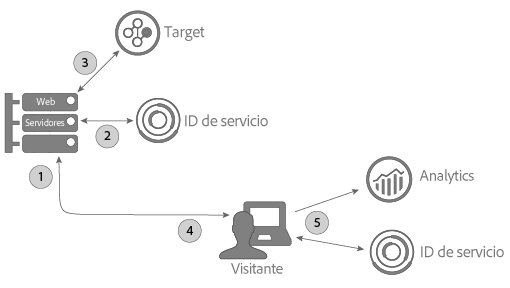

# Uso del servicio ID con A4T y una implementación de Target en el lado del servidor {#using-the-id-service-with-a-t-and-a-server-side-implementation-of-target}

Estas instrucciones van dirigidas a clientes de A4T con implementaciones mixtas de lado de servidor y de cliente de Target, Analytics y el servicio de ID. Los clientes que necesiten ejecutar el servicio de ID en un entorno de NodeJS o Rhino deberían también consultar esta información. Esta instancia del servicio de ID utiliza una versión abreviada de la biblioteca de códigos VisitorAPI.js, la cual se descarga e instala desde el administrador de paquetes de nodos (NPM). Lea esta sección para conocer las instrucciones de instalación y otros requisitos de configuración.

## Introducción {#section-ab0521ff5bbd44c592c3eaab31c1de8b}

A4T (y otros clientes) puede usar esta versión del servicio de ID cuando necesiten hacer lo siguiente:

* Procesar contenido de páginas web en sus servidores y pasárselo a un navegador para que este lo muestre.
* Realizar llamadas de [!DNL Target] del lado del servidor.
* Realizar llamadas del lado de cliente (dentro del navegador) a [!DNL Analytics].
* Sincronizar identificadores de [!DNL Target] y de [!DNL Analytics] por separado para determinar si un visitante que haya sido visto por una solución es la misma persona que otra solución puede haber visto.

## Descarga de código e interfaces proporcionadas {#section-32d75561438b4c3dba8861be6557be8a}

Consulte el [repositorio NPM del servicio de ID](https://www.npmjs.com/package/@adobe-mcid/visitor-js-server) para descargar el paquete de código del lado de servidor y ver las interfaces que se incluyen en la versión actual.

## Flujo de trabajo {#section-56b01017922046ed96536404239a272b}

El diagrama y las secciones que siguen describen qué ocurre y qué debe configurar en cada paso del proceso de implementación del lado de servidor.



## Paso 1: Solicitar página {#section-c12e82633bc94e8b8a65747115d0dda8}

La actividad del lado de servidor comienza cuando un visitante realiza una solicitud HTTP para cargar una página web. En este paso, el servidor recibe la solicitud y comprueba la cookie de [Cookie AMCV](../introduction/cookies.md). La cookie AMCV contiene el ID de [!DNL Experience Cloud] (MID).

## Paso 2: Generación de la carga útil del servicio de ID {#section-c86531863db24bd9a5b761c1a2e0d964}

A continuación, debe realizar una *`payload request`* del lado del servidor en el servicio de ID. Las solicitudes de carga útil hacen lo siguiente:

* Pasan la cookie de AMCV al servicio de ID.
* Solicitan datos que Target y Analytics necesitan en los pasos subsiguientes que se describen a continuación.

>[!NOTE]
>
>Este método solicita un solo mbox desde [!DNL Target]. Si necesita solicitar varios mboxes en una sola llamada, consulte [generateBatchPayload](https://www.npmjs.com/package/@adobe-mcid/visitor-js-server#generatebatchpayload).

Su solicitud de carga útil deberá ser como el ejemplo de código que sigue: En el ejemplo del código, la función `visitor.setCustomerIDs` es opcional. Consulte [ID de cliente y estados de autenticación](../reference/authenticated-state.md) para obtener más información.

```js
//Import the ID service server package 
var Visitor = require("@adobe-mcid/visitor-js-server"); 
 
//Pass in your Organization ID to instantiate Visitor 
var visitor = new Visitor("Insert Experience Cloud ID here"); 
 
// 
<i>(Optional)</i> Set a custom customer ID 
visitor.setCustomerIDs({ 
     userid:{ 
          id:"1234", 
          authState: Visitor.AuthState.UNKNOWN //AuthState is a static property of the Visitor class 
     } 
}); 
 
//Parse the visitor's HTTP request for the AMCV cookie 
var cookies = cookie.parse(req.headers.cookie || ""); 
var cookieName = visitor.getCookieName(); // Visitor API that returns the cookie name. 
var amcvCookie = cookies[cookieName]; 
 
//Generate the payload request pass your mbox name and the AMCV cookie if present 
var visitorPayload = visitor.generatePayload({ 
     mboxName: "bottom-banner-mbox", 
     amcvCookie: amcvCookie 
});
```

El servicio de ID devuelve la carga útil en un objeto JSON parecido al ejemplo siguiente. Los datos de carga útil los necesita [!DNL Target].

```js
{ 
    "marketingCloudVisitorId": "02111696918527575543455026275721941645", 
    "mboxParameters": { 
        "mboxAAMB": "abcd1234", 
        "mboxMCGLH": "9", 
        "mboxMCSDID": "56BE026543F7E211-1CC51BCAAE88F0D2", 
        "vst.userid.id": "1234567890", 
        "vst.userid.authState": 0 
    } 
}
```

Si su visitante no tiene una cookie de AMCV, la carga útil omite estos pares clave-valor:

* `marketingCloudvisitorId`
* `mboxAAMB`
* `mboxMCGLH`

## Paso 3: Adición de la carga útil a la llamada de Target {#section-62451aa70d2f44ceb9fd0dc2d4f780f7}

Una vez que el servidor recibe los datos de carga útil del servicio de ID, deberá crear una instancia de código adicional para fusionarla con los datos transferidos a [!DNL Target]. El objeto JSON final transferido a [!DNL Target] tendría un aspecto similar a este:

```js
{ 
"mbox" : "target-global-mbox", 
"marketingCloudVisitorId":"02111696918527575543455026275721941645", 
"requestLocation" : { 
     "pageURL" : "http://www.domain.com/test/demo.html", 
     "host" : "localhost:3000" 
     }, 
"mboxParameters" : { 
     "mboxAAMB" : "abcd1234", 
     "mboxMCGLH" : "9", 
     "mboxMCSDID": "56BE026543F7E211-1CC51BCAAE88F0D2", 
     "vst.userid.id": "1234567890", 
     "vst.userid.authState": 0, 
     } 
} 
```

## Paso 4: Obtención del estado del servidor para el servicio de ID {#section-8ebfd177d42941c1893bfdde6e514280}

Los datos del estado del servidor incluyen información acerca del trabajo realizado en el servidor. El código del servicio de ID del lado de cliente requiere esta información. Los clientes que han implementado el servicio de ID a través de [!DNL Dynamic Tag Manager] (DTM) pueden configurar DTM para transferir los datos del estado del servidor a través de esa herramienta. Si ha configurado el servicio de ID por medio de un proceso no estándar, deberá devolver el estado del servidor con su propio código. El servicio de ID del lado de cliente y el código de [!DNL Analytics] transfieren los datos de estado a Adobe al cargarse la página.

**Obtención del estado del servidor a través de DTM**

Si ha implementado el servicio de ID con DTM, debe agregar código a su página y especificar un par nombre-valor en la configuración de DTM.

**Código de página**

Agregue este código a la etiqueta `<head>` de su página HTML:

```js
//Get server state 
var serverState = visitor.getState(); 
 
Response.send(" 
... 
<head> 
     <script> 
          //Add 'serverState' as a stringified JSON global variable. 
          "var serverState = "+ JSON.stringify(serverState) +";  
     </script> 
     <script src = "DTM script (satellite JS)"> 
     </script> 
</head> 
...
```

**Ajustes de configuración de DTM**

Agregue estos pares nombre-valor a la sección **[!UICONTROL General &gt; Configuración]** de su instancia del servicio de ID:

* **[!UICONTROL Nombre:]** serverState
* **[!UICONTROL Valor:]** %serverState%

   >[!IMPORTANT]
   >
   >El nombre del valor debe coincidir con el nombre de variable definido para `serverState` en el código de página.

Una vez configurados, los ajustes deberán verse así:


Consulte también [Configuración del servicio de identidad de Experience Cloud para DTM](../implementation-guides/standard.md#concept-fb6cb6a0e6cc4f10b92371f8671f6b59).

**Obtención del estado del servidor sin DTM**

Si su implementación del servicio de ID es estándar, debe configurar este código para que se ejecute en el servidor mientras monta la página solicitada:

```js
//Get server state 
var serverState = visitor.getState(); 
 
Response.send(" 
... 
<head> 
     <script src="VisitorAPI.js"></script> 
     <script> 
          var visitor = Visitor.getInstance(orgID, { 
          serverState: serverState  
          ... 
     </script> 
</head> 
...
```

## Paso 5: Servicio de una página y devolución de datos de Experience Cloud {#section-4b5631a0d75a41febd6f43f8c214c263}

En este punto, el servidor web envía el contenido de la página al navegador del visitante. A partir de este punto, el navegador (no el servidor) realiza el resto de las llamadas del servicio de ID y de [!DNL Analytics]. Por ejemplo, en el navegador:

* El servicio de ID recibe datos de estado del servidor y pasa el SDID a AppMeasurement.
* AppMeasurement envía datos sobre la visita a la página a [!DNL Analytics], incluido el SDID.
* [!DNL Analytics] y [!DNL Target] comparan los SDID del visitante. Con un SDID idéntico, [!DNL Target] y [!DNL Analytics] unen la llamada del lado de servidor y la llamada del lado de cliente. En este punto, ambas soluciones pueden reconocer al visitante como la misma persona.

>[!MORE_LIKE_THIS]
>
>* [Paquete de servicio de ID del lado de servidor desde el administrador de paquetes de nodos](https://www.npmjs.com/package/@adobe-mcid/visitor-js-server)

