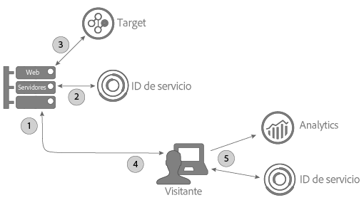

# Uso del servicio de ID de visitante con A4T y una implementación de Target en el lado del servidor {#using-the-id-service-with-a-t-and-a-server-side-implementation-of-target}

Estas instrucciones están destinadas a los clientes de A4T con implementaciones mixtas del lado del servidor y del cliente de Target, Analytics y el servicio de ID de visitante. Los clientes que necesiten ejecutar el servicio de ID de visitante en un entorno NodeJS o Rhino también deben consultar esta información. Esta instancia del servicio de ID de visitante utiliza una versión abreviada de la biblioteca de códigos `VisitorAPI.js`, que se descarga e instala desde el Administrador de paquetes de nodos (NPM). Lea esta sección para obtener instrucciones de instalación y otros requisitos de configuración.

## Introducción {#section-ab0521ff5bbd44c592c3eaab31c1de8b}

A4T (y otros clientes) pueden utilizar esta versión del servicio de ID de visitante cuando necesiten:

* Procesar el contenido de la página web en sus servidores y pasarlo a un explorador para que lo muestre por última vez.
* Realizar llamadas de Target del lado del servidor.
* Realizar llamadas del lado del cliente (dentro del explorador) a Analytics.
* Sincronice los ID de Target y de Analytics por separado para determinar si un visitante que haya sido visto por una solución es la misma persona que otra solución ha visto.

## Descarga de código e interfaces proporcionadas {#section-32d75561438b4c3dba8861be6557be8a}

Consulte el [repositorio NPM del servicio de ID de visitante](https://www.npmjs.com/package/@adobe-mcid/visitor-js-server) para descargar el paquete de código del lado del servidor y ver las interfaces que se incluyen en la versión actual.

## Flujo de trabajo {#section-56b01017922046ed96536404239a272b}

El diagrama y las secciones que siguen describen qué ocurre y qué debe configurar en cada paso del proceso de implementación del lado del servidor.



## Paso 1: Solicitar página {#section-c12e82633bc94e8b8a65747115d0dda8}

La actividad del lado de servidor comienza cuando un visitante realiza una solicitud HTTP para cargar una página web. Durante este paso, el servidor recibe esta solicitud y comprueba la [cookie AMCV](../introduction/cookies.md). La cookie AMCV contiene el ECID del visitante.

## Paso 2: Generación de carga útil del servicio de ID de visitante {#section-c86531863db24bd9a5b761c1a2e0d964}

A continuación, debe realizar un *`payload request`* del lado del servidor en el servicio de ID de visitante. Una solicitud de carga útil:

* Pasa la cookie AMCV al servicio de ID de visitante.
* Solicita datos que Target y Analytics necesitan en los pasos siguientes que se describen a continuación.

>[!NOTE]
>
>Este método solicita un solo mbox desde Target. Si necesita solicitar varios mboxes en una sola llamada, consulte [generateBatchPayload](https://www.npmjs.com/package/@adobe-mcid/visitor-js-server#generatebatchpayload).

Su solicitud de carga útil deberá ser como el ejemplo de código que sigue: En el ejemplo del código, la función `visitor.setCustomerIDs` es opcional. Consulte [ID de cliente y estados de autenticación](../reference/authenticated-state.md) para obtener más información.

```js
//Import the Visitor ID Service server package 
var Visitor = require("@adobe-mcid/visitor-js-server"); 
 
//Pass in your IMS org ID to instantiate Visitor 
var visitor = new Visitor("Insert ECID here"); 
 
// 
<i>(Optional)</i> Set a custom customer ID 
visitor.setCustomerIDs({ 
     userid:{ 
          id:"1234", 
          authState: Visitor.AuthState.UNKNOWN //AuthState is a static property of the Visitor class 
     } 
}); 
 
//Parse the visitor's HTTP request for the AMCV cookie 
var cookies = cookie.parse(req.headers.cookie || ""); 
var cookieName = visitor.getCookieName(); // Visitor API that returns the cookie name. 
var amcvCookie = cookies[cookieName]; 
 
//Generate the payload request pass your mbox name and the AMCV cookie if present 
var visitorPayload = visitor.generatePayload({ 
     mboxName: "bottom-banner-mbox", 
     amcvCookie: amcvCookie 
});
```

El servicio de ID de visitante devuelve la carga en un objeto JSON similar al siguiente ejemplo. Target requiere los datos de carga útil.

```js
{ 
    "marketingCloudVisitorId": "02111696918527575543455026275721941645", 
    "mboxParameters": { 
        "mboxAAMB": "abcd1234", 
        "mboxMCGLH": "9", 
        "mboxMCSDID": "56BE026543F7E211-1CC51BCAAE88F0D2", 
        "vst.userid.id": "1234567890", 
        "vst.userid.authState": 0 
    } 
}
```

Si su visitante no tiene una cookie de AMCV, la carga útil omite estos pares clave-valor:

* `marketingCloudvisitorId`
* `mboxAAMB`
* `mboxMCGLH`

## Paso 3: Adición de la carga útil a la llamada de Target {#section-62451aa70d2f44ceb9fd0dc2d4f780f7}

Una vez que el servidor recibe los datos de carga útil del servicio de ID de visitante, deberá crear una instancia de código adicional para fusionarla con los datos pasados a Target. El objeto JSON final transferido a Target tendría un aspecto similar a este:

```js
{ 
"mbox" : "target-global-mbox", 
"marketingCloudVisitorId":"02111696918527575543455026275721941645", 
"requestLocation" : { 
     "pageURL" : "http://www.domain.com/test/demo.html", 
     "host" : "localhost:3000" 
     }, 
"mboxParameters" : { 
     "mboxAAMB" : "abcd1234", 
     "mboxMCGLH" : "9", 
     "mboxMCSDID": "56BE026543F7E211-1CC51BCAAE88F0D2", 
     "vst.userid.id": "1234567890", 
     "vst.userid.authState": 0, 
     } 
} 
```

## Paso 4: Obtención del estado del servidor para el servicio de ID de visitante {#section-8ebfd177d42941c1893bfdde6e514280}

Los datos de estado del servidor contienen información sobre el trabajo realizado en el servidor. El código del servicio de ID de visitante del lado del cliente requiere esta información. Si ha configurado el servicio de ID de visitante mediante un proceso no estándar, deberá devolver el estado del servidor con su propio código. El servicio de ID de visitante del lado del cliente y el código de Analytics pasan datos de estado a Adobe cuando se carga la página.

Si su implementación del servicio de ID de visitante es estándar, debe configurar este código para que se ejecute en el servidor mientras monta la página solicitada:

```js
//Get server state 
var serverState = visitor.getState(); 
 
Response.send(" 
... 
<head> 
     <script src="VisitorAPI.js"></script> 
     <script> 
          var visitor = Visitor.getInstance(orgID, { 
          serverState: serverState  
          ... 
     </script> 
</head> 
...
```

## Paso 5: Servicio de una página y devolución de datos de CX Enterprise {#section-4b5631a0d75a41febd6f43f8c214c263}

En este punto, el servidor web envía el contenido de la página al navegador del visitante. A partir de este punto, el navegador (no el servidor) realiza todas las llamadas restantes del servicio de ID de visitante y de Analytics. Por ejemplo, en el explorador:

* El servicio de ID de visitante recibe datos de estado del servidor y pasa el SDID a AppMeasurement.
* AppMeasurement envía datos sobre la visita a la página a Analytics, incluido el SDID.
* Analytics y Target comparan los SDID de este visitante. Con un SDID idéntico, Target y Analytics unen la llamada del lado del servidor y la llamada del lado del cliente. En este punto, ambas soluciones pueden reconocer al visitante como la misma persona.

>[!MORELIKETHIS]
>
>* [Paquete de servicio de ID de visitante del lado del servidor desde el administrador de paquetes de nodos](https://www.npmjs.com/package/@adobe-mcid/visitor-js-server)

