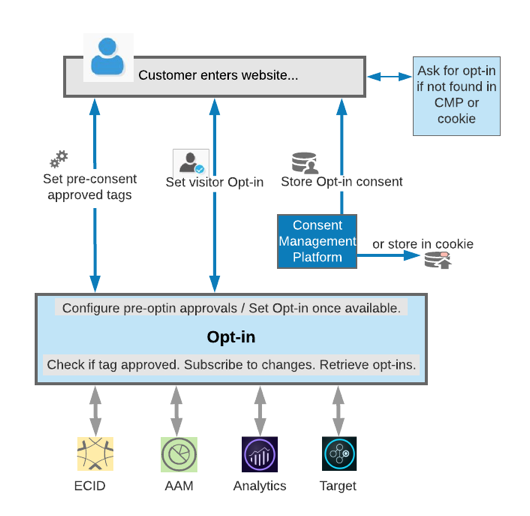

# servicio de inclusión (Opt-in){#opt-in-service}

Con el servicio de inclusión (Opt-in) puede configurar protocolos para que un visitante de su sitio decida si le permite establecer una cookie en su dispositivo o explorador.

El servicio de inclusión (Opt-in) es una extensión del servicio de Experience Cloud ID (ECID) diseñada para controlar si las soluciones de Experience Cloud pueden crear cookies en las páginas web de los visitantes con el consentimiento del usuario, y cuáles pueden hacerlo. Además, le permite configurar una integración con su plataforma de gestión de consentimiento (CMP) y con los sistemas existentes como parte de su diseño general.

El servicio de inclusión (Opt-in) le permite especificar si un visitante puede incluirse en las soluciones de Adobe de una sola vez, o si se le presentan las soluciones una tras otra para que vaya aprobando los permisos. Una vez que el cliente completa y registra el proceso de aprobación, puede recuperar las aprobaciones de visitante de CMP desde las soluciones de Adobe.

El servicio de inclusión se implementa y se configura fácilmente con [etiquetas en Adobe Experience Platform ](https://experienceleague.adobe.com/docs/experience-platform/tags/home.html?lang=es) con la [extensión de inclusión](../../implementation-guides/opt-in-service/launch.md). También se puede implementar y configurar utilizando [DTM.](../../implementation-guides/opt-in-service/optin-dtm.md)

Consulte [Configuración del servicio de inclusión (Opt-in)](../../implementation-guides/opt-in-service/getting-started.md) para comenzar.

>[!NOTE]
>
>El servicio de inclusión (Opt-in) le permite configurar un sistema para aprobar o rechazar la descarga únicamente de las cookies de Adobe. Ni permite recopilar las preferencias de consentimiento de los usuarios ni es un repositorio de preferencias.

>[!IMPORTANT]
>
>El contenido de este documento no constituye asesoramiento jurídico y no está pensado para sustituir el asesoramiento jurídico. Pida asesoramiento al departamento jurídico de su empresa respecto al consentimiento y las prácticas recomendadas para configurar una implementación de inclusión.

## Inclusión entre soluciones de Experience Cloud {#section-053e6224505542cf961896f0ca869e52}

El servicio de inclusión (Opt-in) es una herramienta para la creación de flujos de trabajo de inclusión de consentimiento adaptados a sus necesidades. Puede crear flujos de trabajo con los que reaccionar (activar etiquetas) antes y después de obtener el consentimiento del usuario o del responsable del tratamiento del consentimiento.

El servicio de inclusión (Opt-in) le permite establecer prácticas de gestión del consentimiento para soluciones de Adobe con las que podrá hacer lo siguiente:

* Indique si los requisitos de recopilación de consentimiento se aplican en general a un usuario.
* Especifique qué soluciones pueden generar cookies.
* Aplique las preferencias predeterminadas para cualquier solución cuya categoría no haya sido aceptada o rechazada explícitamente por el usuario.
* Active la respuesta personalizada en función de los cambios en la configuración de consentimiento de un usuario, lo que le permite mantener o actualizar la configuración del usuario.

Mediante el servicio de inclusión (Opt-in) puede configurar su sitio de modo que permita la carga de algunas cookies con preconsentimiento, antes de la elección del usuario. Puede configurar los servicios de inclusión para nuevos clientes de modo que sea posible cargar cookies tras dar el usuario su consentimiento, o tras quedar disponible una elección. También puede almacenar y recuperar el consentimiento de inclusión de su plataforma de administración de consentimiento existente o simplemente almacenar los permisos de inclusión en una cookie.

Las soluciones de Adobe pueden comprobar si la etiqueta está aprobada, suscribirse a los cambios y recuperar a todos los clientes de inclusión. El servicio de inclusión (Opt-in) le permite obtener permisos directamente mediante la solución de bibliotecas de JavaScript o mediante los ECID, de estar implementados.

