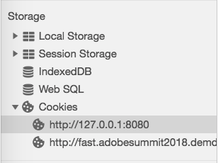
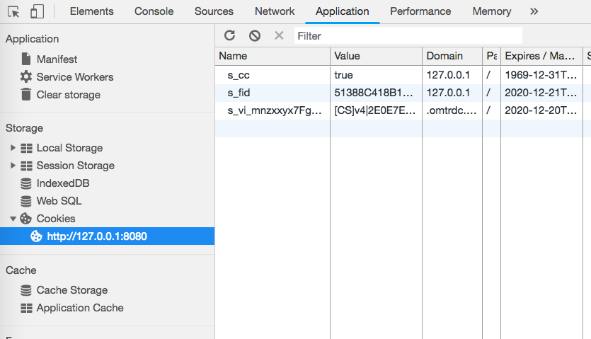

# Validación del servicio de inclusión (Opt-in) {#validating-opt-in-service}

Una vez que haya habilitado el servicio de inclusión (Opt-in) en su sitio web, utilice los métodos de validación y las herramientas de desarrollo de su navegador para comprobar que el servicio funcione correctamente.

## Caso de uso 1: Habilitar el servicio de inclusión (Opt-in) {#section-c8fe1ee3711b420c8186c7057abbecb3}

```
Visitor.getInstance({{YOUR_ORG_ID}}, { 
    doesOptInApply: true 
});
```


Antes de cargar la página, borre la caché y las cookies.

En Chrome, haga clic con el botón derecho en la página web y seleccione Inspeccionar. Tal como se muestra en la captura de pantalla anterior, seleccione la pestaña *Red* para ver las solicitudes realizadas desde el explorador.

En el ejemplo anterior, tenemos instaladas las siguientes etiquetas JS de Adobe en la página: ECID, AAM, Analytics y Target.

**Método para comprobar si el servicio de inclusión (Opt-in) está funcionando correctamente:**

No debería ver ninguna solicitud a los servidores de Adobe:

* demdex.net/id
* demdex.net/event
* omtrdc.net/b/ss
* omtrdc.net/m2
* everesttech.net

>[!NOTE]
>
>Podría ver una llamada a `http://dpm.demdex.net/optOutStatus`, un extremo de SOLO LECTURA que se utiliza para recuperar el estado de exclusión del visitante. Este extremo no dará como resultado la creación de cookies de terceros y no se recopilará ninguna información de la página.

No debería ver ninguna cookie que hayan creado las etiquetas de Adobe: (AMCV_{{YOUR_ORG_ID}}, mbox, demdex, s_cc, s_sq, everest_g_v2, everest_session_v2)

En Chrome, vaya a la pestaña *Aplicación*, expanda la sección *Cookies* en *Almacenamiento* y seleccione el nombre de dominio de su sitio web:



## Caso de uso 2: Habilitar Opt-in y almacenamiento   {#section-bd28326f52474fa09a2addca23ccdc0f}

```
Visitor.getInstance({{YOUR_ORG_ID}}, { 
    doesOptInApply: true, 
    isOptInStorageEnabled: true 
});
```

La única diferencia en el caso de uso 2 es que verá *una nueva cookie* que contiene los permisos de Opt-in que el visitante ha proporcionado: **adobeujs-optin**

## Caso de uso 3: Habilitar Opt-in y preaprobar Adobe Analytics   {#section-257fe582b425496cbf986d0ec12d3692}

```
var preApproveAnalytics = {}; 
preApproveAnalytics[adobe.OptInCategories.ANALYTICS] = true;

Visitor.getInstance({{YOUR_ORG_ID}}, { 
    doesOptInApply: true, 
    preOptInApprovals: preApproveAnalytics 
});
```

Dado que Adobe Analytics está previamente incluido, verá solicitudes en la ficha Red a su servidor de seguimiento:


También verá cookies de Analytics en la pestaña Aplicación:



## Caso de uso 4: Habilitar Opt-in e IAB   {#section-64331998954d4892960dcecd744a6d88}

```
Visitor.getInstance({{YOUR_ORG_ID}}, { 
    doesOptInApply: true, 
    isIabContext: true 
});
```

**Visualización del consentimiento IAB actual en la página:**

Abra las herramientas para desarrolladores y seleccione la pestaña *Consola*. Pegue el siguiente fragmento de código y pulse Intro:

```
<codeblock>
  __cmp("getVendorConsents", null, function (vendorConsents) { 
     console.log("Vendor Consent:", vendorConsents); }) 
</codeblock>  
  
```

Este es un ejemplo del resultado que se obtiene cuando se aprueban los propósitos 1, 2 y 5, y se aprueba el ID del proveedor de Audience Manager:

* demdex.net/id: La presencia de esta llamada demuestra que ECID ha solicitado un ID de demdex.net
* demdex.net/event: La presencia de esta llamada prueba que la llamada de recopilación de datos del DIL está funcionando según lo esperado.
* demdex.net/dest5.html: La presencia de esta llamada demuestra que se están activando las sincronizaciones de ID.


Si una de las siguientes opciones no es válida, no verá ninguna solicitud a los servidores de Adobe ni cookies de Adobe:

* Los propósitos 1, 2 O 5 no están aprobados.
* El ID del proveedor de Audience Manager no está aprobado.
