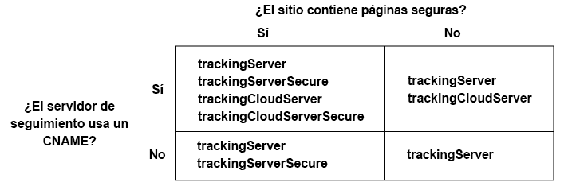

# Implementación del servicio Experience Cloud ID para Analytics, Audience Manager y Target {#implement-the-experience-cloud-id-service-for-analytics-audience-manager-and-target}

Estas instrucciones están destinadas a los clientes de Analytics, Audience Manager y Target que desean utilizar el servicio Experience Cloud ID y no usan la administración dinámica de etiquetas (DTM). No obstante, le recomendamos encarecidamente que utilice DTM para implementar el servicio de ID. DTM racionaliza el flujo de trabajo de implementación y garantiza la colocación y secuencia correcta del código automáticamente.

>[!IMPORTANT]
>
>Read the ID service [requirements](../reference/requirements.md) before you begin and note the following requirements that are specific to this implementation: &gt;
>* Los clientes que usen s_code no podrán completar este procedimiento. Actualice al código mbox v61 para completar este procedimiento.
>* Configure y pruebe este código en un entorno de desarrollo *antes* de implementarlo en producción.
>


## Step 1: Plan for server-side forwarding {#section-880797cc992d4755b29cada7b831f1fc}

Además de los pasos descritos aquí, los clientes que usan [!DNL Analytics] y [!DNL Audience Manager] deben migrar al reenvío del lado de servidor. El reenvío del lado de servidor permite eliminar el código DIL (el código de recopilación de datos de Audience Manager) y sustituirlo por el [módulo Gestión de público](https://marketing.adobe.com/resources/help/en_US/aam/c_profiles_audiences.html). Consulte la [documentación de reenvío del lado de servidor](https://marketing.adobe.com/resources/help/en_US/reference/ssf.html) para obtener más información.

Migrar al reenvío del lado de servidor requiere planificación y coordinación. Este proceso conlleva realizar cambios externos en el código del sitio, así como determinados pasos internos que Adobe debe implementar para aprovisionar su cuenta. De hecho, muchos de estos procedimientos de migración han de suceder en paralelo e implementarse al mismo tiempo. Su ruta de implementación deberá seguir esta secuencia de eventos:

1. Trabaje con sus contactos de [!DNL Analytics] y [!DNL Audience Manager] para planificar el servicio de ID y la migración de reenvío del lado de servidor. Haga que la selección de un servidor de seguimiento conforme una parte importante de este plan.

1. Get provisioned for [!DNL Profiles & Audiences]. Complete el formulario en el [sitio de aprovisionamiento e integraciones](https://adobe.allegiancetech.com/cgi-bin/qwebcorporate.dll?idx=X8SVES) para ponerse en marcha.

1. Implement the ID service and the [!DNL Audience Management Module] simultaneously. To work properly, the [!DNL Audience Management Module] (server-side forwarding) and the ID service must be released for the same set of pages and at the same time.

## Step 2: Download the ID Service code {#section-0780126cf43e4ad9b6fc5fe17bb3ef86}

El servicio de ID requiere la biblioteca de códigos `VisitorAPI.js`. Para descargar esta biblioteca de códigos:

1. Vaya a **[!UICONTROL Administración &gt; Administrador de códigos]**.
1. En Administrador de códigos, haga clic en **[!UICONTROL JavaScript (nuevo)]** o **[!UICONTROL JavaScript (heredado)]**. Se descargarán las bibliotecas de códigos comprimidas.

1. Descomprima el archivo de códigos y abra el archivo `VisitorAPI.js`.

## Step 3: Add the Visitor.getInstance function to the ID Service code {#section-9e30838b4d0741658a7a492153c49f27}

>[!IMPORTANT]
>
>* Las versiones anteriores de la API del servicio de ID ubicaban esta función en un lugar distinto y requerían una sintaxis diferente. Si va a migrar desde una versión anterior a la [versión 1.4](../release-notes/notes-2015.md#section-f5c596f355b14da28f45c798df513572), anote la nueva ubicación y la sintaxis documentadas aquí.
>* El código que aparece TODO EN MAYÚSCULAS funciona como marcador de posición para valores reales. Sustituya este texto por el ID de su organización, la URL del servidor de seguimiento u otro valor con nombre.
>


**Parte 1: Copia de la función Visitor.getInstance a continuación**

```js
var visitor = Visitor.getInstance("INSERT-MARKETING-CLOUD-ORGANIZATION ID-HERE", { 
     trackingServer: "INSERT-TRACKING-SERVER-HERE", // same as s.trackingServer 
     trackingServerSecure: "INSERT-SECURE-TRACKING-SERVER-HERE", // same as s.trackingServerSecure 
 
     // To enable CNAME support, add the following configuration variables 
     // If you are not using CNAME, DO NOT include these variables 
     marketingCloudServer: "INSERT-TRACKING-SERVER-HERE", 
     marketingCloudServerSecure: "INSERT-SECURE-TRACKING-SERVER-HERE" // same as s.trackingServerSecure 
}); 
```

**Parte 2: Adición del código de función al archivo VisitorAPI.js**

Coloque la función `Visitor.getInstance` al final del archivo, después del bloque de códigos. El archivo editado debería tener un aspecto similar a este:

```js
/* 
========== DO NOT ALTER ANYTHING BELOW THIS LINE ========== 
Version and copyright section 
*/ 
 
// Visitor API code library section 
 
// Put Visitor.getInstance at the end of the file, after the code library 
 
var visitor = Visitor.getInstance("INSERT-MARKETING-CLOUD-ORGANIZATION ID-HERE", { 
     trackingServer: "INSERT-TRACKING-SERVER-HERE", // same as s.trackingServer 
     trackingServerSecure: "INSERT-SECURE-TRACKING-SERVER-HERE", // same as s.trackingServerSecure 
 
     // To enable CNAME support, add the following configuration variables 
     // If you are not using CNAME, DO NOT include these variables 
     marketingCloudServer: "INSERT-TRACKING-SERVER-HERE", 
     marketingCloudServerSecure: "INSERT-SECURE-TRACKING-SERVER-HERE" // same as s.trackingServerSecure 
}); 
```

## Step 4: Add your Experience Cloud Organization ID to Visitor.getInstance {#section-e2947313492546789b0c3b2fc3e897d8}

In the `Visitor.getInstance` function, replace `INSERT-MARKETING-CLOUD-ORGANIZATION ID-HERE` with your Experience Cloud organization ID. Si no conoce su ID de organización, puede encontrarlo en la página de administración de Experience Cloud. Su función editada podría tener un aspecto similar al ejemplo siguiente.

`var visitor = Visitor.getInstance("1234567ABC@AdobeOrg", { ...`

>[!IMPORTANT]
>
>*No* cambie el caso de los caracteres del identificador de organización. El ID distingue entre mayúsculas y minúsculas y debe escribirse exactamente como se facilita.

## Step 5: Add your tracking servers to Visitor.getInstance {#section-0dfc52096ac2427f86045aab9a0e0dfc}

Analytics utiliza servidores de seguimiento para recopilar datos.

**Parte 1: Búsqueda de las URL de su servidor de seguimiento**

Check your `s_code.js` or `AppMeasurement.js` files to find the tracking server URLs. Buscará las URL especificadas por estas variables:

* `s.trackingServer`
* `s.trackingServerSecure`

**Parte 2: Establecimiento de variables del servidor de seguimiento**

Para determinar las variables del servidor de seguimiento que se van a emplear:

1. Responda las preguntas de la matriz de decisión siguiente. Use las variables que se correspondan con las respuestas.
1. Sustituya los marcadores del servidor de seguimiento por las URL de su servidor de seguimiento.
1. Elimine las variables del servidor de seguimiento y del servidor de Experience Cloud no utilizadas del código.



>[!NOTE]
>
>Cuando se utilice, combine las URL del servidor de Experience Cloud con las URL de su servidor de seguimiento correspondiente de este modo:

* URL del servidor de Experience Cloud = URL del servidor de seguimiento
* URL segura del servidor de Experience Cloud = URL segura del servidor de seguimiento

Si no está seguro de cómo encontrar su servidor de seguimiento, consulte las [Preguntas más frecuentes](../faq-intro/faq.md) y [Rellenar correctamente las variables trackingServer y trackingServerSecure](https://helpx.adobe.com/analytics/kb/determining-data-center.html#). 

## Step 6: Update your AppMeasurement.js file {#section-5517e94a09bc44dfb492ebca14b43048}

This step requires [!DNL AppMeasurement]. No podrá continuar si aún utiliza s_code.

Add the `Visitor.getInstance` function shown below to your `AppMeasurement.js` file. Place it in the section that contains configurations such as `linkInternalFilters`, `charSet`, `trackDownloads`, etc. :

`s.visitor = Visitor.getInstance("INSERT-MARKETING-CLOUD-ORGANIZATION ID-HERE");`

>[!IMPORTANT]
>
>At this point, you should remove the [!DNL Audience Manager] DIL code and replace it with the Audience Management Module. Consulte las instrucciones en [Implementar el reenvío del lado de servidor](https://marketing.adobe.com/resources/help/en_US/reference/ssf.html).

***(Opcional, pero recomendada)*Crear una variable prop personalizada**

Establezca una prop personalizada en `AppMeasurement.js` para medir la cobertura. Agregue esta variable prop personalizada a la función `doPlugins` de su archivo `AppMeasurement.js`:

```js
// prop1 is used as an example only. Choose any available prop. 
s.prop1 = (typeof(Visitor) != "undefined" ? "VisitorAPI Present" : "VisitorAPI Missing");
```

## Step 7: Add Visitor API code to the page {#section-c2bd096a3e484872a72967b6468d3673}

Place the ` [!DNL VisitorAPI.js]` file within the `<head>` tags on each page. Cuando coloque el archivo `VisitorAPI.js` en su página:

* Put it at the beginning of the `<head>` section to it appears before other solution tags.
* Debe ejecutarse antes de AppMeasurement y el código de otras soluciones de [!DNL Experience Cloud].

## Step 8: (Optional) Configure a grace period {#section-aceacdb7d5794f25ac6ff46f82e148e1}

If any of these use cases apply to your situation, ask [Customer Care](https://helpx.adobe.com/marketing-cloud/contact-support.html) to set up a temporary [grace period](../reference/analytics-reference/grace-period.md). Los períodos de gracia pueden prolongarse hasta 180 días. Si es necesario, puede renovar un período de gracia.

**Implementación parcial**

Necesita un período de gracia si hay páginas que usan el servicio de ID y otras no, y si todas envían su informe al mismo grupo de informes de Analytics. Esta suele ser la situación habitual cuando se tiene un grupo de informes global que reporta entre dominios.

Interrumpa el período de gracia una vez que se haya implementado el servicio de ID en todas las páginas web que reportan al mismo grupo de informes.

**Requisitos de la cookie s_vi**

Necesita un período de gracia si necesita que nuevos visitantes tengan una cookie s_vi después de migrar al servicio de ID. Esto es lo habitual si su implementación lee la cookie s_vi y la almacena en una variable.

Interrumpa el período de gracia cuando su implementación pueda capturar el MID en lugar de leer la cookie s_vi.

See also, [Cookies and the Experience Cloud ID Service](../introduction/cookies.md).

**Integración de flujo de navegación**

Necesita un período de gracia si envía datos a un sistema interno desde una fuente de datos de flujo de navegación y si sus procesos utilizan las columnas `visid_high` y `visid_low`.

Discontinue the grace period after your data ingestion process can use the `post_visid_high` and `post_visid_low` columns.

Consulte también [Referencia de columnas de datos del flujo de navegación](https://marketing.adobe.com/resources/help/en_US/sc/clickstream/datafeeds_reference.html).

## Step 9: Test and verify {#section-f857542bfc70496dbb9f318d6b3ae110}

Las soluciones de [!DNL Experience Cloud] de esta implementación devuelven ID en forma de pares clave-valor. Cada solución utiliza claves diferentes (p. ej., el SDID de [!DNL Analytics] frente al mboxMCSDID de [!DNL Target]) para guardar el mismo ID. Para probar su implementación, cargue sus páginas en un entorno de desarrollo. Utilice la consola del explorador o software que monitoree las solicitudes HTTP y las respuestas para comprobar los ID que se indican a continuación. El servicio de ID se ha implementado correctamente cuando los pares clave-valor que se enumeran a continuación devuelven los mismos valores de ID.

>[!TIP]
>
>You can use the [Adobe Debugger](https://marketing.adobe.com/resources/help/en_US/sc/implement/?f=debugger.html) or the [Charles HTTP proxy](https://www.charlesproxy.com/) to check for these solution-specific IDs. No obstante, es libre de usar la herramienta o el depurador que más le convenga.

**Todas las soluciones**

Compruebe:

* [La cookie AMCV](../introduction/cookies.md) en el dominio en el que está alojada su página.
* [!DNL Experience Cloud] ID (MID) con [!DNL Adobe] el depurador o su herramienta de depuración favorita.

For additional checks that help you determine if the ID service is working properly, see [Test and Verify the Experience Cloud ID Service](../implementation-guides/test-verify.md).

**Analytics**

Compruebe el identificador SDID en la solicitud de JavaScript. El SDID de Analytics debe coincidir con el mboxMCSDID de Target.

Si sus pruebas devuelven un AID, será indicativo de alguna de estas situaciones:

* Usted es un visitante que regresa en el proceso de migrar ID de [!DNL Analytics] heredados.
* You have a [grace period](../reference/analytics-reference/grace-period.md) enabled.

Si ve un AID, compare su valor con el mboxMCAVID de [!DNL Target]. Estos valores son idénticos cuando el servicio de ID se ha implementado correctamente.

**Audience Manager**

Para probar el reenvío del lado de servidor, consulte:

* [Cómo determinar si su cuenta está lista para recibir datos reenviados](https://marketing.adobe.com/resources/help/en_US/aam/ssf-success.html)
* [Cómo determinar si su cuenta no está lista para recibir datos reenviados](https://marketing.adobe.com/resources/help/en_US/aam/ssf-fail.html)

**Target**

Compruebe:

* mboxMCGVID
* mboxMCSDID (el mboxMCSDID debe coincidir con el SDID de Analytics)

Si sus pruebas devuelven un mboxMCAVID, será indicativo de alguna de estas situaciones:

* Usted es un visitante que regresa en el proceso de migrar ID de [!DNL Analytics] heredados.
* Tiene un período de gracia habilitado.

Si ve un mboxMCAVID, compare su valor con el AID de [!DNL Analytics]. Estos valores son idénticos cuando el servicio de ID se ha implementado correctamente.

**Implementación**

## Step 10: Deploy {#section-4188fa95e7dc455a986b48a6c517c1c9}

Implementación del código una vez pasada la prueba.

Si ha habilitado un período de gracia:

* Asegúrese de que el ID de Analytics (AID) y el MID estén en la solicitud de imagen.
* Recuerde deshabilitar el período de gracia cuando se cumplan los [criterios para ello](../implementation-guides/setup-aam-analytics-target.md#section-aceacdb7d5794f25ac6ff46f82e148e1).

