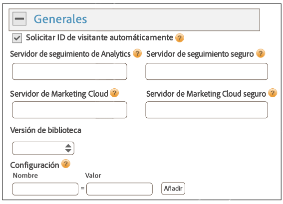
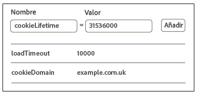
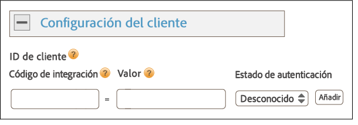
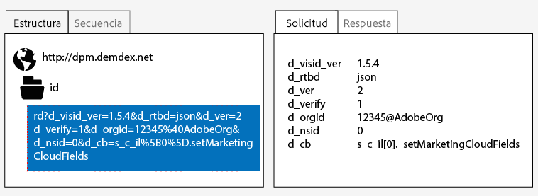
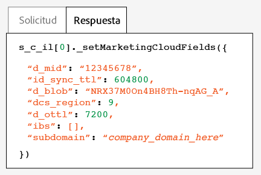

# Implementación con Dynamic Tag Management {#implementation-with-dynamic-tag-management}

Las implementaciones más antiguas utilizan la Dynamic Tag Management (DTM) para configurar, implementar e integrar el servicio de Experience Cloud ID con el resto de las soluciones de Experience Cloud.

## Implementación con Dynamic Tag Management {#topic-6f4ed5d96977406ca991e50f3fbd5b01}

Las implementaciones más antiguas utilizan la Dynamic Tag Management (DTM) para configurar, implementar e integrar el servicio de Experience Cloud ID con el resto de las soluciones de Experience Cloud.

>[!NOTE]
>
>En la actualidad, [Adobe Experience Platform Launch](https://docs.adobelaunch.com/) es la herramienta de implementación recomendada porque simplifica complejas tareas de administración de etiquetas y automatiza la colocación de código más allá de las capacidades de DTM. Consulte [Implementación con Launch](../implementation-guides/ecid-implement-with-launch.md)

## Dynamic Tag Management y el servicio de ID {#section-4a4c4fac5d0a4cbbaff8e1833f73657c}

[Dynamic Tag Management](https://marketing.adobe.com/resources/help/es_ES/dtm/) permite configurar, implementar y gestionar su instancia de servicio de ID y de las diferentes integraciones de [!DNL Experience Cloud]. DTM ayuda a simplificar el proceso de implementación, ya que está profundamente integrado con el servicio de ID y con otras soluciones de Experience Cloud. Simplemente agregue y configure la herramienta de Experience Cloud ID, y especifique la información oportuna, como:

* ID de organización de Experience Cloud (se rellena automáticamente si se vincula con Experience Cloud)
* Servidor de seguimiento de Analytics (seguro y no seguro)
* Servidor de Experience Cloud (para servidores de seguimiento propios)

Todos los [!DNL Experience Cloud] clientes de pueden disponer gratuitamente de DTM.

**Introducción a DTM**

DTM es una herramienta sencilla pero potente. Si aún no la usa, le recomendamos encarecidamente que lo haga. Consulte la [documentación de DTM](https://marketing.adobe.com/resources/help/es_ES/dtm/c_overview.html) y [los vídeos de iniciación de DTM](https://marketing.adobe.com/resources/help/es_ES/dtm/jump-start-videos.html) para comenzar a usar este servicio. Para ver instrucciones sobre cómo configurar el servicio de ID con DTM, consulte la información y los procedimientos que se describen en las secciones a continuación.

## Guías de implementación {#concept-54a2ec49af8f4bfca9207b1d404e8e1a}

Lea estos requisitos y procedimientos antes de intentar implementar el servicio de identidad de Experience Cloud con la Dynamic Tag Management (DTM).

<!--
mcvid-dtm-deployment.xml
-->

**Aprovisionar su cuenta**

Antes de empezar, asegúrese de que su organización y sus soluciones se han aprovisionado para [!DNL Experience Cloud] y de que esté familiarizado con la [!DNL Dyanamic Tag Management]. Esta documentación puede ayudarle a empezar:

* [Habilite las soluciones para servicios principales](https://marketing.adobe.com/resources/help/es_ES/mcloud/core_services.html): Implemente Experience Cloud y conviértase en administrador. Este proceso moderniza las soluciones para servicios principales como los atributos del cliente y las audiencias de Experience Cloud.
* [Introducción a Dynamic Tag Management](https://marketing.adobe.com/resources/help/es_ES/dtm/get_started.html)
* [Vídeos de iniciación](https://marketing.adobe.com/resources/help/es_ES/dtm/jump-start-videos.html): Una serie de breves vídeos que muestran cómo llevar a cabo tareas básicas de DTM.

**Colocación del código del servicio de ID y orden de carga**

El servicio de ID funciona por medio de la solicitud y la recepción de un ID único desde los servidores de recopilación de datos de [!DNL Adobe]. Para poder funcionar correctamente, su código de servicio de ID debe:

* Ser el primer bloque de [!DNL Adobe] código de que se ejecute en la página;
* Colocarse en una posición en la página tan alta como sea posible, por lo general dentro del bloque de `<head>`.

Siempre que mantenga todas sus soluciones de [!DNL Adobe] y sus bibliotecas de código en DTM, podrá estar seguro de que el código del servicio de ID se colocará en la ubicación adecuada y se activará en el momento oportuno.

**Validar la recopilación de datos regionales**

Los clientes deben proporcionar un CNAME o usar `*.sc.omtrdc` para la [recopilación de datos regionales ](https://marketing.adobe.com/resources/help/es_ES/whitepapers/rdc/) (RDC). Solicite la configuración RDC específica a su consultor de [!DNL Adobe].

**Configurar grupos de informes de Analytics**

[!DNL Analytics] Los nuevos clientes deben [crear un grupo de informes](https://marketing.adobe.com/resources/help/es_ES/reference/new_report_suite.html) para la recopilación de datos.

## Implementación del servicio de identidad de Experience Cloud con DTM {#task-a659cf19dea84ad48edabe0b72ef9f5c}

Siga estos pasos para implementar el servicio de ID con Dynamic Tag Management (DTM).

**Requisitos previos**

* Habilite sus soluciones para [!DNL Experience Cloud] y verifique que dispone de permisos de administrador. Consulte [Activación de las soluciones para los servicios principales](https://marketing.adobe.com/resources/help/es_ES/mcloud/core_services.html).

* Cree una propiedad web en DTM. Consulte la documentación [propiedad Crear una Web](https://marketing.adobe.com/resources/help/es_ES/dtm/web_property.html) de DTM o los [vídeos de iniciación](https://marketing.adobe.com/resources/help/es_ES/dtm/admin-jump-start.html).

<!--
mcvid-dtm-implement.xml
-->

**Pasos de implementación** del servicio de ID con DTM:

1. En el [!UICONTROL tablero] de DTM, haga clic en la propiedad web con la que desee trabajar.
1. En la pestaña **[!UICONTROL Información general]** de la propiedad web que haya seleccionado, haga clic en **[!UICONTROL Agregar una herramienta]**.
1. En la lista **[!UICONTROL Tipo de herramienta]**, haga clic en **[!UICONTROL servicio de identidad de Experience Cloud]**.

   >[!NOTE]
   >
   >Esta acción rellenará el cuadro de **[!UICONTROL ID de organización de Experience Cloud]** con el ID de su organización. Si su cuenta de DTM no está vinculada a [!DNL Experience Cloud], deberá proporcionar este ID. Para vincular su cuenta, consulte [Vincular cuentas en Experience Cloud](https://marketing.adobe.com/resources/help/es_ES/mcloud/organizations.html). Consulte los [requisitos](../reference/requirements.md#section-a02f537129a64ffbb690d5738d360c26) para ver información sobre cómo localizar el ID de su organización.

1. Escriba el nombre de su servidor de seguimiento en el cuadro **[!UICONTROL Servidor de seguimiento]**. Si no está seguro de cómo encontrar su servidor de seguimiento, consulte [las preguntas frecuentes](../faq-intro/faq.md) y [Rellenar correctamente las variables trackingServer y trackingServerSecure](https://helpx.adobe.com/es/analytics/kb/determining-data-center.html#).
1. Haga clic en **[!UICONTROL Crear herramienta]** y en **[!UICONTROL Guardar cambios]**.

   Tras la operación de guardar, el servicio de ID quedará configurado como una herramienta dentro de DTM. No obstante, aún no estará listo para usarse. Su herramienta de DTM todavía tendrá que pasar por el proceso de publicación/aprobación de DTM, y es posible que le interese configurar otros parámetros adicionales. Para obtener más información sobre el proceso de aprobación de DTM, consulte el [Vídeo de iniciación de conceptos básicos para usuarios](https://marketing.adobe.com/resources/help/es_ES/dtm/user-basics-jump-start.html). Para obtener más información sobre los parámetros adicionales que puede agregar a DTM, consulte [Configuración del servicio de identidad de Experience Cloud para DTM](../implementation-guides/standard.md#concept-fb6cb6a0e6cc4f10b92371f8671f6b59).

>[!MORE_LIKE_THIS]
>
>* [Propiedades web](https://marketing.adobe.com/resources/help/es_ES/dtm/web_property.html)


## Configuración del servicio de identidad de Experience Cloud para DTM{#concept-fb6cb6a0e6cc4f10b92371f8671f6b59}

Describe los campos [!UICONTROL ID de organización], [!UICONTROL General] y [!UICONTROL Configuración de cliente], así como el modo en el que el servicio de ID de [!DNL Experience Cloud] los emplea.

<!--
mcvid-dtm-settings.xml
-->

## ¿Cómo encuentro estos ajustes de configuración?{#section-c5b2d1c928944ae2b8565c1b182fe575}

Los ajustes de configuración estarán disponibles después de agregar y guardar el servicio de ID como herramienta dentro de Dynamic Tag Management (DTM). También se puede acceder a estos ajustes haciendo clic en el icono de la rueda de engranaje de la sección [!UICONTROL Herramientas instaladas] de la propiedad web de DTM.


## ID de organización {#section-949b5a0d8af940558b04ff675cf53f77}

Este es el ID necesario y asociado a la empresa de [!DNL Experience Cloud] aprovisionada. Una organización es la entidad que habilita un administrador para configurar grupos y usuarios, y controlar el inicio de sesión único en [!DNL Experience Cloud]. El ID de organización es una cadena alfanumérica de 24 caracteres seguida de @AdobeOrg (que debe ir incluido). Los administradores de [!DNL Experience Cloud] pueden encontrar este ID en [Experience Cloud &gt; Herramientas](https://marketing.adobe.com/resources/help/es_ES/mcloud/admin_getting_started.html).


Consulte también la información relativa a las [Cookies y el servicio de identidad de Experience Cloud](../introduction/cookies.md).

## Configuración general {#section-071d358e40f84629a8901b893dd61392}

Estos ajustes le permiten especificar servidores de seguimiento y versiones de código, así como agregar otras variables.



La tabla a continuación enumera y define los ajustes [!UICONTROL generales].

**Solicitar ID de visitante automáticamente**

Si está marcada esta opción, la administración dinámica de etiquetas llama automáticamente al método `getMarketingCloudVisitorID()` antes de cargar alguna de las soluciones de Adobe que use el servicio de identidad de Experience Cloud.

Consulte [getMarketingCloudVisitorID](../library/get-set/getmcvid.md).

**Servidor de seguimiento de Analytics**

El nombre del servidor de seguimiento utilizado para la recopilación de datos de Analytics. Este es el dominio donde se escribe la solicitud de imagen y la cookie (p. ej., `http://site.omtrdc.net`).

Si no sabe cuáles son las direcciones URL del servidor de seguimiento, consulte sus archivos `s_code.js` o `AppMeasurement.js`. La que le interesa es la URL que establece la `s.trackingServer` variable.

Consulte [trackingServer](https://marketing.adobe.com/resources/help/es_ES/sc/implement/trackingServer.html) y [Relleno correcto de las variables trackingServer y trackingServerSecure](https://helpx.adobe.com/es/analytics/kb/determining-data-center.html#).

**Servidor de seguimiento seguro**

El nombre del servidor de seguimiento seguro utilizado para la recopilación de datos de Analytics. Este es el dominio donde se escribe la solicitud de imagen y la cookie (p. ej., `https://site.omtrdc.net`).

Si no sabe cuáles son las direcciones URL del servidor de seguimiento, consulte sus archivos `s_code.js` o `AppMeasurement.js`. La que le interesa es la URL que establece la `s.trackingServerSecure` variable.

Consulte [trackingServer](https://marketing.adobe.com/resources/help/es_ES/sc/implement/trackingServer.html) y [Relleno correcto de las variables trackingServer y trackingServerSecure](https://helpx.adobe.com/es/analytics/kb/determining-data-center.html#).

**Servidor de Experience Cloud**

Si su empresa utiliza la recopilación de datos de origen (CNAME) para usar cookies de origen en un contexto de terceros, introduzca el servidor de seguimiento aquí (p. ej., `http://metrics.company.com`).

**Servidor de Experience Cloud seguro**

Si su empresa utiliza la recopilación de datos de origen (CNAME) para usar cookies de origen en un contexto de terceros, introduzca el servidor de seguimiento aquí (p. ej., `https://metrics.company.com`).

**Versión de biblioteca**

Establece la versión de la biblioteca de código del servicio de ID (`VisitorAPI.js`) que desea utilizar. Estas opciones de menú no se pueden editar.

**Configuración**

Estos campos le permiten agregar [variables de función](../library/function-vars/function-vars.md) como pares clave-valor. Haga clic en **[!UICONTROL Agregar]** para agregar una variable o más a su implementación del servicio de ID.



>[!IMPORTANT]
>
>Establezca la `cookieDomain` variable. Necesaria para dominios de nivel superior y de múltiples partes, donde alguna de las dos últimas partes de la URL tiene más de dos caracteres. Consulte la documentación sobre variables de configuración cuyos vínculos aparecen más arriba.

## Configuración de cliente {#section-238d1272c1504d148fe38fb0ae5d71c2}

Campos adicionales que le permiten agregar un código de integración o un estado de autenticación.



**Código de integración**

Un código de integración es un ID único que proporciona el cliente. El código de integración debe contener el valor utilizado para [crear la fuente de datos](https://marketing.adobe.com/resources/help/en_US/aam/create-datasource.html) en [!DNL Audience Manager].

**Valor**

El valor debe ser un elemento de datos que contenga el ID de usuario. Los elementos de datos son buenos contenedores de valores dinámicos, como los ID de un sistema interno específico del cliente.

**Estado de autenticación**

Opciones que definen o identifican a los visitantes según su estado de autenticación (p. ej., si ha iniciado sesión o si la ha cerrado). Consulte [Estados de autenticación e ID de clientes](../reference/authenticated-state.md)

## Comprobación y verificación del servicio de identidad de Experience Cloud{#concept-644fdbef433b46ba9c0634ac95eaa680}

Estas instrucciones, herramientas y procedimientos le ayudan a determinar si el servicio de ID está funcionando correctamente. Estas pruebas se aplican al servicio de ID en general, así como a diferentes combinaciones de soluciones del servicio de ID y [!DNL Experience Cloud].

<!--
mcvid-test-verify.xml
-->

## Antes de empezar {#section-b1e76ad552ed4eb793b6e521a55127d4}

Información importante necesaria antes de comenzar a probar y verificar el servicio de ID.

**Entornos de exploradores**

Cuando vaya a realizar pruebas en una sesión de navegador normal, borre la caché de su navegador antes de cada prueba.

También puede probar el servicio de ID en una sesión de navegador anónima o de incógnito. En una sesión anónima no necesitará borrar las cookies del navegador ni la caché antes de cada prueba.

**Herramientas**

[Adobe Debugger](https://marketing.adobe.com/resources/help/es_ES/sc/implement/debugger.html) y [el proxy Charles HTTP ](https://www.charlesproxy.com/) pueden ayudarle a determinar si el servicio de ID se ha configurado para funcionar correctamente con Analytics. La información en esta sección se basa en los resultados devueltos por la herramienta de depuración de Adobe y Charles. No obstante, es libre de usar la herramienta o el depurador que más le convenga.

## Pruebas con la herramienta de depuración de Adobe {#section-861365abc24b498e925b3837ea81d469}

Su integración del servicio se ha configurado correctamente cuando aparece un [!DNL Experience Cloud ID] (MID) en la respuesta de la herramienta de depuración de [!DNL Adobe]. Consulte [Cookies y el servicio de Experience Cloud ID](../introduction/cookies.md) para obtener más información sobre el MID.

Para verificar el estado del servicio de ID con [!DNL Adobe] [Debugger](https://marketing.adobe.com/resources/help/es_ES/sc/implement/debugger.html):

1. Borre las cookies del navegador o abra una sesión de navegación anónima.
1. Cargue su página de prueba con el código del servicio de ID.
1. Abra la herramienta [!DNL Adobe] Debugger.
1. Busque en los resultados un MID.

## Comprender los resultados de Adobe Debugger {#section-bd2caa6643d54d41a476d747b41e7e25}

El MID se almacena en un par clave-valor que sigue esta sintaxis: `MID= *`Experience Cloud ID`*`. El depurador muestra esta información tal y como se ve a continuación.

**Correcto**

El servicio de ID se ha implementado correctamente si aparece una respuesta similar a esta:

```
mid=20265673158980419722735089753036633573
```

Si es cliente de [!DNL Analytics], es posible que vea un ID de [!DNL Analytics] (AID) además del MID. Esto sucede:

* Con algunos de los primeros visitantes que han llegado su sitio o que le han dedicado mucho tiempo a este.
* Si tiene un período de gracia habilitado.

**Error**

Póngase en contacto con el [Servicio de atención al cliente](https://helpx.adobe.com/es/marketing-cloud/contact-support.html) si Debugger:

* El depurador no devuelve un MID.
* El depurador devuelve un mensaje de error que indica que no se ha proporcionado su ID de socio.

## Pruebas con el proxy HTTP Charles {#section-d9e91f24984146b2b527fe059d7c9355}

Para verificar el estado del servicio de ID con Charles:

1. Borre las cookies del navegador o abra una sesión de navegación anónima.
1. Inicie Charles.
1. Cargue su página de prueba con el código del servicio de ID.
1. Busque las llamadas de solicitud y respuesta y los datos que se describen a continuación.

## Comprender los resultados de Charles {#section-c10c3dc0bb9945cbaffcf6fec7082fab}

Consulte esta sección para ver información sobre dónde y qué buscar al usar Charles para supervisar las llamadas HTTP.

### Solicitudes del servicio de ID correctas en Charles

El código del servicio de ID funciona correctamente cuando la función `Visitor.getInstance` realiza una llamada de JavaScript a `dpm.demdex.net`. Las respuestas correctas incluirán su [identificador de organización](../reference/requirements.md#section-a02f537129a64ffbb690d5738d360c26). El identificador de organización se transfiere como par clave-valor con esta sintaxis: `d_orgid= *`ID de organización`*`. Busque `dpm.demdex.net` y las llamadas de JavaScript en la ficha [!UICONTROL Estructura]. Busque su identificador de organización en la ficha [!UICONTROL Solicitud].



### Respuestas del servicio de ID correctas en Charles

Su cuenta puede utilizar el servicio de ID cuando la respuesta de los [Servidores de recopilación de datos](https://marketing.adobe.com/resources/help/en_US/aam/c_compcollect.html) (DCS) devuelva un MID. El MID se devuelve en un par clave-valor que sigue esta sintaxis: `d_mid: visitor Experience Cloud ID`. Busque el MID en la ficha [!UICONTROL Respuesta], tal y como se ve a continuación.



### Respuestas del servicio de ID incorrectas en Charles

Su cuenta no se ha aprovisionado correctamente si el MID no aparece en la respuesta de los DCS. Una respuesta incorrecta devolverá un código y un mensaje de error en la ficha [!UICONTROL Respuesta], tal y como se ve a continuación. Póngase en contacto con el Servicio de atención al cliente si aparece este mensaje de error en la respuesta del DCS.


Para obtener más información sobre los códigos de error, consulte [Códigos de error DCS, mensajes y ejemplos](https://marketing.adobe.com/resources/help/en_US/aam/dcs_error_codes.html).
