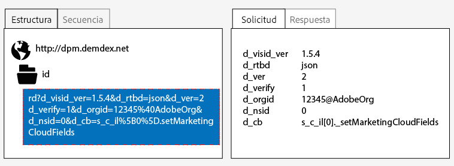
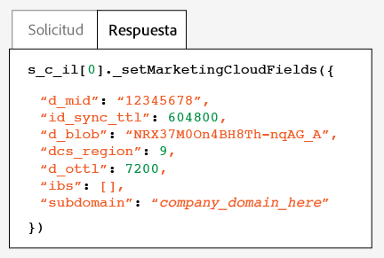
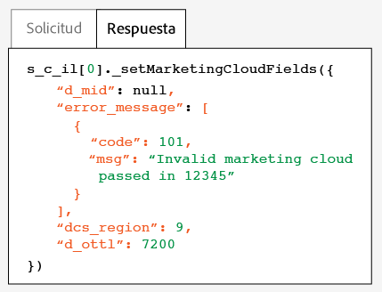

# Comprobación y verificación del servicio de ID de visitante de Adobe{#test-and-verify-the-experience-cloud-id-service}

Estas instrucciones, herramientas y procedimientos le ayudan a determinar si el servicio de ID de visitante funciona correctamente. Estas pruebas se aplican al servicio de ID de visitante en general, así como a diferentes combinaciones de soluciones del servicio de ID de visitante y de CX Enterprise.

## Antes de empezar {#section-b1e76ad552ed4eb793b6e521a55127d4}

Información importante necesaria antes de comenzar a probar y verificar el servicio de ID de visitante.

**Entornos de exploradores**

Cuando realice pruebas en una sesión normal del explorador, borre la caché del explorador antes de cada prueba.

También puede probar el servicio de ID de visitante en una sesión anónima o de incógnito del explorador. En una sesión anónima, no es necesario borrar las cookies del explorador o la caché antes de cada prueba.

**Herramientas**

[Adobe Debugger](https://experienceleague.adobe.com/docs/analytics/implementation/validate/debugger.html?lang=es) y el [proxy HTTP Charles](https://www.charlesproxy.com/) pueden ayudarle a determinar si el servicio de identificación del visitante se ha configurado para funcionar correctamente con Analytics. La información de esta sección se basa en los resultados devueltos por Adobe Debugger y Charles. No obstante, es libre de usar la herramienta o el depurador que más le convenga.

## Pruebas con la herramienta de depuración de Adobe {#section-861365abc24b498e925b3837ea81d469}

La integración del servicio se ha configurado correctamente cuando aparece un ECID en la respuesta de Adobe Debugger. Consulte [Cookies y el servicio de ID de visitante](../introduction/cookies.md) para obtener más información sobre el MID.

Para comprobar el estado del servicio de identificación del visitante con Adobe [Debugger](https://experienceleague.adobe.com/docs/analytics/implementation/validate/debugger.html?lang=es):

1. Borre las cookies del explorador o abra una sesión de navegación anónima.
1. Cargue la página de prueba que contiene el código del servicio de ID de visitante.
1. Abra Adobe Debugger.
1. Busque en los resultados un MID.

## Comprender los resultados de Adobe Debugger {#section-bd2caa6643d54d41a476d747b41e7e25}

El MID se almacena en un par clave-valor que sigue esta sintaxis: `MID= *`ECID`*`. El depurador muestra esta información tal y como se ve a continuación.

**Correcto**

El servicio de ID de visitante se ha implementado correctamente si ve una respuesta similar a la siguiente:

```
mid=20265673158980419722735089753036633573
```

Si es cliente de Analytics, es posible que vea un ID de Analytics (AID) además del MID. Esto sucede:

* Con algunos de los visitantes iniciales e históricos del sitio.
* Si tiene un periodo de gracia habilitado.

**Fallo**

Contacte con el servicio de [atención al cliente](https://helpx.adobe.com/es/marketing-cloud/contact-support.html) si Debugger:

* No devuelve un MID.
* Devuelve un mensaje de error que indica que el ID de socio no se ha aprovisionado.

## Pruebas con el proxy HTTP Charles {#section-d9e91f24984146b2b527fe059d7c9355}

Para verificar el estado del servicio de ID de visitante con Charles:

1. Borre las cookies del explorador o abra una sesión de navegación anónima.
1. Inicie Charles.
1. Cargue la página de prueba que contiene el código del servicio de ID de visitante.
1. Compruebe las llamadas de solicitud y respuesta y los datos que se describen a continuación.

## Comprender los resultados de Charles {#section-c10c3dc0bb9945cbaffcf6fec7082fab}

Consulte esta sección para ver información sobre dónde y qué buscar al usar Charles para monitorizar las llamadas HTTP.

**Solicitudes del servicio de ID de visitante correctas en Charles**

Su código del servicio de ID de visitante funciona correctamente cuando la función `Visitor.getInstance` realiza una llamada de JavaScript a `dpm.demdex.net`. Una solicitud correcta incluye su [ID de organización de IMS](../reference/requirements.md#section-a02f537129a64ffbb690d5738d360c26). El identificador de organización de IMS se pasa como par clave-valor que sigue esta sintaxis: `d_orgid= *`identificador de organización de IMS`*`. Busque `dpm.demdex.net` y las llamadas de JavaScript en la pestaña [!UICONTROL Structure]. Busque su ID de organización de IMS en la pestaña [!UICONTROL Request].



**Respuestas del servicio de ID de visitante correctas en Charles**

Su cuenta se ha aprovisionado correctamente para el servicio de ID de visitante cuando la respuesta de [Servidores de recopilación de datos](https://experienceleague.adobe.com/docs/audience-manager/user-guide/reference/system-components/components-data-collection.html?lang=es) (DCS) devuelve un MID. El MID se devuelve en un par clave-valor que sigue esta sintaxis: `d_mid: *`ECID de visitante`*`. Busque el MID en la pestaña [!UICONTROL Response], tal y como se ve a continuación.



**Respuestas del servicio de ID de visitante incorrectas en Charles**

Su cuenta no se ha aprovisionado correctamente si el MID no aparece en la respuesta de los DCS. Una respuesta incorrecta devolverá un código y un mensaje de error en la pestaña [!UICONTROL Response], tal y como se ve a continuación. Póngase en contacto con el Servicio de atención al cliente si aparece este mensaje de error en la respuesta del DCS.



Para obtener más información sobre los códigos de error, consulte [Códigos de error DCS, mensajes y ejemplos](https://experienceleague.adobe.com/docs/audience-manager/user-guide/api-and-sdk-code/dcs/dcs-api-reference/dcs-error-codes.html?lang=es).

