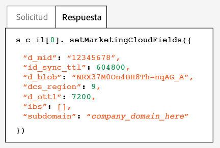

# Comprobación y verificación del servicio de Experience Cloud ID{#test-and-verify-the-experience-cloud-id-service}

Estas instrucciones, herramientas y procedimientos le ayudan a determinar si el servicio de ID está funcionando correctamente. Estas pruebas se aplican al servicio de ID en general, así como a diferentes combinaciones de soluciones del servicio de ID y Experience Cloud.

## Antes de empezar {#section-b1e76ad552ed4eb793b6e521a55127d4}

Información importante necesaria antes de comenzar a probar y verificar el servicio de ID.

**Entornos de exploradores**

Cuando realice pruebas en una sesión normal del explorador, borre la caché del explorador antes de cada prueba.

También puede probar el servicio de ID en una sesión anónima o de incógnito del explorador. En una sesión anónima, no es necesario borrar las cookies del explorador o la caché antes de cada prueba.

**Herramientas**

La [herramienta de depuración de Adobe](https://experienceleague.adobe.com/docs/analytics/implementation/validate/debugger.html?lang=es) y el [proxy HTTP Charles](https://www.charlesproxy.com/) pueden ayudarle a determinar si el servicio de ID se ha configurado para funcionar correctamente con Analytics. La información de esta sección se basa en los resultados devueltos por Adobe Debugger y Charles. No obstante, es libre de usar la herramienta o el depurador que más le convenga.

## Pruebas con la herramienta de depuración de Adobe {#section-861365abc24b498e925b3837ea81d469}

Su integración del servicio se ha configurado correctamente cuando aparece un [!DNL Experience Cloud ID] (MID) en la respuesta de la herramienta de depuración de [!DNL Adobe]. Consulte [Cookies y el servicio de Experience Cloud ID](../introduction/cookies.md) para obtener más información sobre el MID.

Para verificar el estado del servicio de ID con la herramienta [!DNL Adobe] [Debugger](https://experienceleague.adobe.com/docs/analytics/implementation/validate/debugger.html?lang=es):

1. Borre las cookies del explorador o abra una sesión de navegación anónima.
1. Cargue la página de prueba que contiene el código del servicio de ID.
1. Abra la herramienta [!DNL Adobe] Debugger.
1. Busque en los resultados un MID.

## Comprender los resultados de Adobe Debugger {#section-bd2caa6643d54d41a476d747b41e7e25}

El MID se almacena en un par clave-valor que sigue esta sintaxis: `MID= *`Experience Cloud ID`*`. El depurador muestra esta información tal y como se ve a continuación.

**Correcto**

El servicio de ID se ha implementado correctamente si ve una respuesta similar a esta:

```
mid=20265673158980419722735089753036633573
```

Si es cliente de [!DNL Analytics], es posible que vea un ID de [!DNL Analytics] (AID) además del MID. Esto sucede:

* Con algunos de los visitantes iniciales e históricos del sitio.
* Si tiene un periodo de gracia habilitado.

**Fallo**

Contacte con el servicio de [atención al cliente](https://helpx.adobe.com/es/marketing-cloud/contact-support.html) si Debugger:

* No devuelve un MID.
* Devuelve un mensaje de error que indica que el ID de socio no se ha aprovisionado.

## Pruebas con el proxy HTTP Charles {#section-d9e91f24984146b2b527fe059d7c9355}

Para verificar el estado del servicio de ID con Charles:

1. Borre las cookies del explorador o abra una sesión de navegación anónima.
1. Inicie Charles.
1. Cargue la página de prueba que contiene el código del servicio de ID.
1. Compruebe las llamadas de solicitud y respuesta y los datos que se describen a continuación.

## Comprender los resultados de Charles {#section-c10c3dc0bb9945cbaffcf6fec7082fab}

Consulte esta sección para ver información sobre dónde y qué buscar al usar Charles para supervisar las llamadas HTTP.

**Solicitudes del servicio de ID correctas en Charles**

El código del servicio de ID funciona correctamente cuando la función `Visitor.getInstance` realiza una llamada de JavaScript a `dpm.demdex.net`. Las respuestas correctas incluirán su [identificador de organización](../reference/requirements.md#section-a02f537129a64ffbb690d5738d360c26). El identificador de organización se transfiere como par clave-valor con esta sintaxis: `d_orgid= *`ID de organización`*`. Busque `dpm.demdex.net` y las llamadas de JavaScript en la ficha [!UICONTROL Estructura]. Busque su identificador de organización en la ficha [!UICONTROL Solicitud].


**Respuestas del servicio de ID correctas en Charles**

Su cuenta se ha aprovisionado correctamente para el servicio de ID cuando la respuesta de los [servidores de recopilación de datos](https://experienceleague.adobe.com/docs/audience-manager/user-guide/reference/system-components/components-data-collection.html?lang=es) (DCS) devuelve un MID. El MID se devuelve en un par clave-valor que sigue esta sintaxis: `d_mid: *`Experience Cloud ID de visitante`*`. Busque el MID en la ficha [!UICONTROL Respuesta], tal y como se ve a continuación.



**Respuestas del servicio de ID incorrectas en Charles**

Su cuenta no se ha aprovisionado correctamente si el MID no aparece en la respuesta de los DCS. Una respuesta incorrecta devolverá un código y un mensaje de error en la pestaña [!UICONTROL Respuesta], tal y como se ve a continuación. Póngase en contacto con el Servicio de atención al cliente si aparece este mensaje de error en la respuesta del DCS.


Para obtener más información sobre los códigos de error, consulte [Códigos de error DCS, mensajes y ejemplos](https://experienceleague.adobe.com/docs/audience-manager/user-guide/api-and-sdk-code/dcs/dcs-api-reference/dcs-error-codes.html?lang=es).
