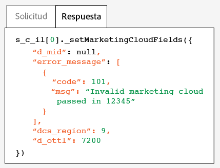

# Test and verify the Experience Cloud ID Service{#test-and-verify-the-experience-cloud-id-service}

Estas instrucciones, herramientas y procedimientos le ayudan a determinar si el servicio de ID está funcionando correctamente. Estas pruebas se aplican al servicio de ID en general, así como a diferentes combinaciones de soluciones del servicio de ID y Experience Cloud.

## Antes de empezar {#section-b1e76ad552ed4eb793b6e521a55127d4}

Información importante para saber antes de comenzar a probar y verificar el servicio de ID.

**Entornos del explorador**

Cuando vaya a realizar pruebas en una sesión de navegador normal, borre la caché de su navegador antes de cada prueba.

También puede probar el servicio de ID en una sesión de navegador anónima o de incógnito. En una sesión anónima no necesitará borrar las cookies del navegador ni la caché antes de cada prueba.

**Herramientas**

La [herramienta de depuración de Adobe](https://marketing.adobe.com/resources/help/en_US/sc/implement/debugger.html) y el [proxy HTTP Charles](https://www.charlesproxy.com/) pueden ayudarle a determinar si el servicio de ID se ha configurado para funcionar correctamente con Analytics. La información en esta sección se basa en los resultados devueltos por la herramienta de depuración de Adobe y Charles. No obstante, es libre de usar la herramienta o el depurador que más le convenga.

## Pruebas con la herramienta de depuración de Adobe {#section-861365abc24b498e925b3837ea81d469}

Your service integration is configured properly when you see a [!DNL Experience Cloud ID] (MID) in the [!DNL Adobe] debugger response. See [Cookies and the Experience Cloud ID Service](../introduction/cookies.md) for more information about the MID.

To verify the status of the ID service with the [!DNL Adobe] [debugger](https://marketing.adobe.com/resources/help/en_US/sc/implement/debugger.html):

1. Borre las cookies del navegador o abra una sesión de navegación anónima.
1. Cargue su página de prueba con el código del servicio de ID.
1. Open the [!DNL Adobe] debugger.
1. Busque en los resultados un MID.

## Understanding Adobe Debugger results {#section-bd2caa6643d54d41a476d747b41e7e25}

The MID is stored in a key-value pair that uses this syntax: `MID= *`Experience Cloud ID`*`. El depurador muestra esta información tal y como se ve a continuación.

**Correcto**

El servicio de ID se ha implementado correctamente si aparece una respuesta similar a esta:

```
mid=20265673158980419722735089753036633573
```

Si es cliente de [!DNL Analytics], es posible que vea un ID de [!DNL Analytics] (AID) además del MID. Esto sucede:

* Con algunos de los primeros visitantes que han llegado su sitio o que le han dedicado mucho tiempo a este.
* Si tiene un período de gracia habilitado.

**Error**

Póngase en contacto con el [Servicio de atención al cliente](https://helpx.adobe.com/marketing-cloud/contact-support.html) en los casos siguientes:

* El depurador no devuelve un MID.
* El depurador devuelve un mensaje de error que indica que no se ha proporcionado su ID de socio.

## Testing with the Charles HTTP proxy {#section-d9e91f24984146b2b527fe059d7c9355}

Para verificar el estado del servicio de ID con Charles:

1. Borre las cookies del navegador o abra una sesión de navegación anónima.
1. Inicie Charles.
1. Cargue su página de prueba con el código del servicio de ID.
1. Busque las llamadas de solicitud y respuesta y los datos que se describen a continuación.

## Understanding Charles results {#section-c10c3dc0bb9945cbaffcf6fec7082fab}

Consulte esta sección para ver información sobre dónde y qué buscar al usar Charles para supervisar las llamadas HTTP.

**Solicitudes de servicio de ID correctas en Charles**

El código del servicio de ID funciona correctamente cuando la función `Visitor.getInstance` realiza una llamada de JavaScript a `dpm.demdex.net`. Las respuestas correctas incluirán su [identificador de organización](../reference/requirements.md#section-a02f537129a64ffbb690d5738d360c26). The Organization ID is passed as a key-value pair that uses this syntax: `d_orgid= *`organization ID`*`. Look for the `dpm.demdex.net` and the JavaScript calls under the [!DNL Structure] tab. Look for your Organization ID under the [!DNL Request] tab.


**Respuestas correctas del servicio de ID en Charles**

Su cuenta se ha aprovisionado correctamente para el servicio de ID cuando la respuesta de los [servidores de recopilación de datos](https://marketing.adobe.com/resources/help/en_US/aam/c_compcollect.html) (DCS) devuelve un MID. The MID is returned as a key-value pair that uses this syntax: `d_mid: *`visitor Experience Cloud ID`*`. Look for the MID in the [!DNL Response] tab as shown below.


**Respuestas del servicio de ID fallidas en Charles**

Su cuenta no se ha aprovisionado correctamente si el MID no aparece en la respuesta de los DCS. An unsuccessful response returns an error code and message in the [!DNL Response] tab as shown below. Póngase en contacto con el Servicio de atención al cliente si aparece este mensaje de error en la respuesta del DCS.



Para obtener más información sobre los códigos de error, consulte [Códigos, mensajes y ejemplos de error de DCS](https://marketing.adobe.com/resources/help/en_US/aam/dcs_error_codes.html).
