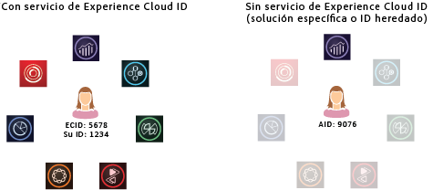

# Acerca del servicio de ID{#aboutidservice}

La función que desempeña el servicio de identidad de Experience Cloud en Adobe Experience Cloud.

<!--
mcvid-functionality.xml
-->

## El servicio de identidad de Experience Cloud: un elemento básico de los servicios principales {#section-2de0eb1d65664e92a4d8bbb167b84bde}

El servicio de identidad de Experience Cloud admite el marco de identificación común para los servicios principales de Experience Cloud, las soluciones y los atributos y audiencias de los clientes. Funciona asignando ID únicos y persistentes a los visitantes del sitio. Cuando su organización implementa el servicio de ID, este ID le permite identificar el mismo visitante del sitio y sus datos en diferentes soluciones de Experience Cloud.

Además, el servicio de ID puede reemplazar los distintos ID específicos de la solución (por ejemplo, Analytics AID). Gracias al [ID de cliente y a la funcionalidad Estado de autenticación](../reference/authenticated-state.md), el servicio de ID le permite transferir sus propios ID de cliente a [!DNL Experience Cloud]. Sin embargo, tenga en cuenta que el servicio de ID solo funciona con las soluciones a las que ya está suscrito. No proporciona acceso a otros productos si no se ha registrado en ellos.

De ahora en adelante, el servicio de ID será un componente integral de muchas funciones, mejoras, y servicios actuales y [!DNL Experience Cloud] futuros de. En la actualidad, el servicio de ID es compatible con [Analytics](http://www.adobe.com/es/marketing-cloud/web-analytics.html), [Audience Manager](http://www.adobe.com/es/marketing-cloud/data-management-platform.html) y [Target](http://www.adobe.com/es/marketing-cloud/testing-targeting.html). Además, es imprescindible para poder participar en [!DNL Adobe Experience Cloud] Device Co-Op de. Si no ha implementado el servicio de ID, ahora es el momento de empezar a pensar en una estrategia de migración.

## Resumen de características {#section-96555473455c4bf8924c2d56ff4f3255}

En resumen, el servicio de ID hace lo siguiente:

* Crea una clave común o ID que se puede utilizar para vincular perfiles e identidades.
* Identifica de forma exclusiva un dispositivo en varias soluciones.
* Establece una cookie de origen en el dominio del cliente para garantizar el seguimiento en el mismo dominio. Consulte [Experience Cloud](../introduction/cookies.md).
* Recibe alias y asignaciones de ID de [!DNL Experience Cloud] clientes y socios.
* Gestiona la sincronización de ID en [!DNL Experience Cloud].
* Admite la sincronización de ID con terceros distintos en el ecosistema tecnológico de publicidad.
