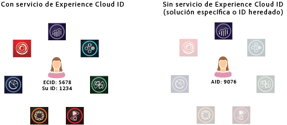

# Acerca del servicio de ID de visitante{#aboutidservice}

Función del servicio de ID de visitante en Adobe CX Enterprise.

<!--
mcvid-functionality.xml
-->

## El servicio de ID de visitante: un elemento básico de los servicios principales {#section-2de0eb1d65664e92a4d8bbb167b84bde}

El servicio de ID de visitante habilita el marco de identificación común para los servicios principales de CX Enterprise, sus soluciones, los atributos de cliente y las audiencias. Funciona asignando ID únicos y persistentes a los visitantes del sitio. Cuando su organización implementa el servicio de ID de visitante, este ID le permite identificar el mismo visitante del sitio y sus datos en diferentes soluciones de CX Enterprise.

Además, el servicio de ID de visitante puede reemplazar los distintos ID específicos de la solución (por ejemplo, Analytics AID). Gracias a la funcionalidad [ID de cliente y estados de autenticación](../reference/authenticated-state.md), el servicio de ID de visitante le permite transferir sus propios ID de cliente a CX Enterprise. Sin embargo, tenga en cuenta que el servicio de ID de visitante solo funciona con las soluciones a las que ya está suscrito. No proporciona acceso a otros productos si no se ha registrado en ellos.

De ahora en adelante, el servicio de ID de visitante será un componente integral de muchas funciones, mejoras y servicios empresariales actuales y futuros de CX. Actualmente, el servicio de identificación del visitante admite [Analytics](http://www.adobe.com/es/marketing-cloud/web-analytics.html), [Audience Manager](http://www.adobe.com/es/marketing-cloud/data-management-platform.html) y [Target](http://www.adobe.com/es/marketing-cloud/testing-targeting.html). Además, es imprescindible para poder participar en Device Co-Op de Adobe. Si no ha implementado el Servicio de ID de visitante, ahora es el momento de empezar a pensar en una estrategia de migración.

## Resumen de características {#section-96555473455c4bf8924c2d56ff4f3255}

En resumen, el servicio de ID de visitante:

* Crea una clave común o ID que se puede utilizar para vincular perfiles e identidades.
* Identifica de forma exclusiva un dispositivo en varias soluciones.
* Establece una cookie de origen en el dominio del cliente para garantizar el seguimiento en el mismo dominio. Consulte [Cookies y el servicio de ID de visitante](../introduction/cookies.md).
* Recibe alias y asignaciones de ID de clientes y socios de CX Enterprise.
* Gestiona la sincronización de ID en CX Enterprise.
* Admite la sincronización de ID con terceros distintos en el ecosistema tecnológico de publicidad.

