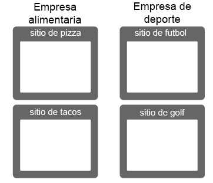
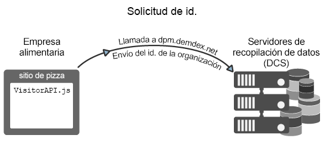
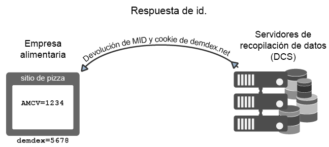
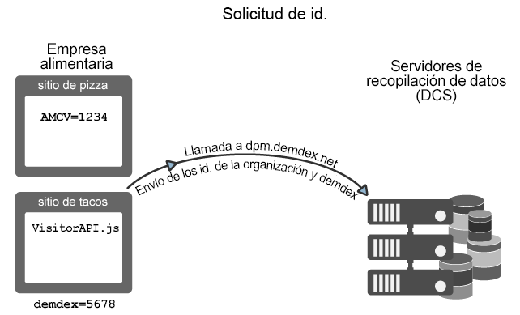
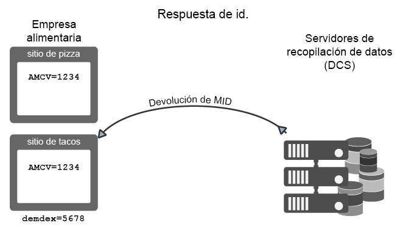
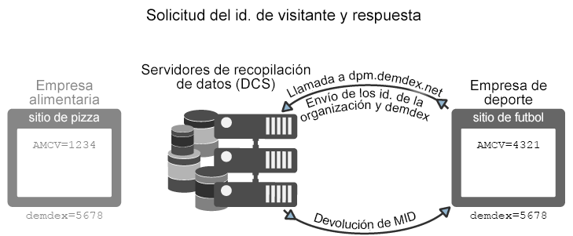

# Solicitud y configuración de ID con el servicio de identidad de Experience Cloud {#how-the-experience-cloud-id-service-requests-and-sets-ids}

Información general sobre el proceso de solicitud y respuesta de ID. Estos ejemplos abarcan la asignación de ID en sitios concretos, entre sitios distintos, y para sitios administrados por clientes de Experience Cloud distintos con sus ID de organización propios.

>[!NOTE]
>
>Si no conoce cómo el servicio de identidad de Experience Cloud crea el ID de visitante, dedique unos minutos a conocer mejor [Experience Cloud](../introduction/cookies.md).

**Sugerencia:** Consulte también nuestro vídeo del [servicio de ID sobre el seguimiento entre dominios](https://helpx.adobe.com/es/marketing-cloud-core/kb/MCID/CrossDomain.html).

## Solicitud de un Experience Cloud ID {#section-0b5e261fbd0547d9b9a1680e5ce536cc}

Los siguientes ejemplos muestran la manera en la que el servicio de ID solicita y recibe el ID de visitante de Experience Cloud. Estos ejemplos usan dos empresas ficticias, la Empresa alimentaria y la Empresa de deporte, para mostrar los flujos de datos para las solicitudes de ID y las respuestas. Cada compañía tiene un ID de organización de Experience Cloud único y ha implementado el código de servicio de ID en todos sus sitios. Estos casos de uso representan flujos de datos para una implementación de servicio de ID genérica sin Analytics, ID heredados o exploradores que bloquean cookies de terceros.

**Primera solicitud**

En este ejemplo, un nuevo visitante llega al sitio de pizzas administrado por Food Company. Food Company tiene un código de servicio de ID en el sitio web de pizzas. Cuando se carga el sitio de pizzas, el código del servicio de ID comprueba la cookie AMCV en el dominio de pizzas.

* Si se establece la cookie AMCV, el visitante del sitio tiene un Experience Cloud ID. En este caso, la cookie rastrea al visitante y comparte datos con otras soluciones de Experience Cloud.
* Si no se establece la cookie AMCV, el código de servicio de ID llama a un [Servidor de recopilación datos regionales](https://docs.adobe.com/content/help/es-ES/analytics/technotes/rdc/regional-data-collection.html) (DCS) en `dpm.demdex.net/id` (consulte también [Explicación de las llamadas al dominio Demdex](https://docs.adobe.com/content/help/es-ES/audience-manager/user-guide/reference/demdex-calls.html)). La llamada incluye el ID de organización de la Empresa Alimentaria. El ID de organización se establece en la función `Visitor.getInstance` del código de servicio de ID.

**Primera respuesta**

En la respuesta, el DCS devuelve el ID de [!DNL Experience Cloud] (MID) y la cookie demdex. El código del servicio de ID escribe el valor MID en la cookie AMCV. Por ejemplo, supongamos que el DCS devuelve un valor MID de 1234. La cookie AMCV se almacenaría como `mid|1234` y se establecería en el dominio de pizzas de origen. La cookie demdex también contiene un ID único (llamémoslo 5678). Esta cookie se establece en el dominio demdex.net de terceros, que es independiente del dominio de pizzas.

Como verá en el siguiente ejemplo, el ID de demdex y el ID de organización permiten al servicio de ID crear y devolver el MID correcto cuando nuestro visitante se desplace a otro sitio que pertenece a Food Company.

## Solicitud y respuesta entre sitios {#section-15ea880453af467abd2874b8b4ed6ee9}

En este ejemplo, nuestro visitante de Food Company navega al sitio de tacos desde el sitio de pizzas. Food Company tiene un código de servicio de ID en el sitio web de tacos. El visitante nunca ha estado en el sitio web de tacos.

Dadas estas condiciones, no hay ninguna cookie AMCV en el sitio de tacos. Además, el servicio de ID no puede usar la cookie AMCV establecida en el sitio de pizzas porque es específica del dominio de pizzas. Como resultado, el servicio de ID debe llamar al DCS para buscar y solicitar un ID de visitante. En este caso, la llamada del DCS incluye el ID de organización de Food Company *y* el ID del demdex. Recuerde que el ID de demdex se recoge del sitio de pizzas y se almacena como una cookie de terceros bajo el dominio demdex.net.

Una vez que el DCS recibe el ID de organización y el ID de demdex, crea y devuelve el MID correcto para el visitante del sitio. Dado que se deriva matemáticamente del ID de organización y del ID de demdex, la cookie AMCV contiene el valor de MID, `mid = 1234`.

## Solicitudes de ID de otros sitios {#section-ba9a929e50d64b0aba080630fd83b6f1}

En este ejemplo, nuestro visitante deja los sitios de Food Company y navega al sitio de fútbol propiedad de Sports Company. Cuando el visitante llega al sitio de fútbol, el proceso de verificación y solicitud de ID funciona del mismo modo que en los ejemplos anteriores. Sin embargo, como Sports Company tiene su propio ID de organización, el servicio de ID devuelve un MID diferente. El nuevo MID es único para los dominios controlados por la Empresa de deporte y permite que esta empresa siga y comparta los datos del visitante entre soluciones en [!DNL Experience Cloud]. El ID de demdex sigue siendo el mismo para este visitante, ya que está contenido en una cookie de terceros y se mantiene entre dominios distintos.

