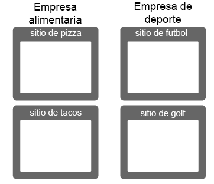
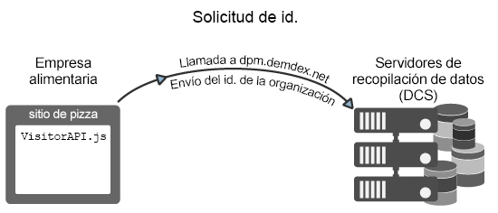
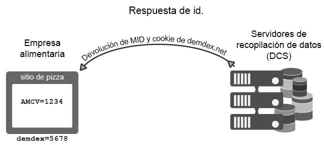
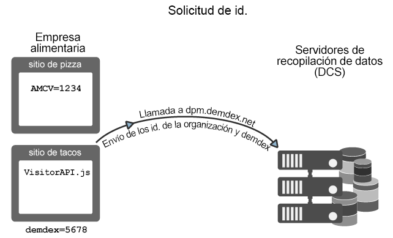
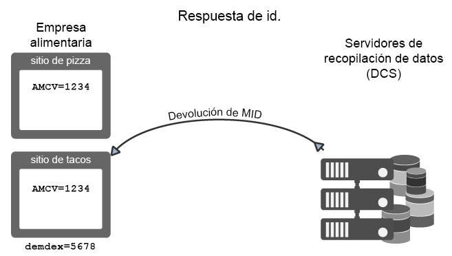
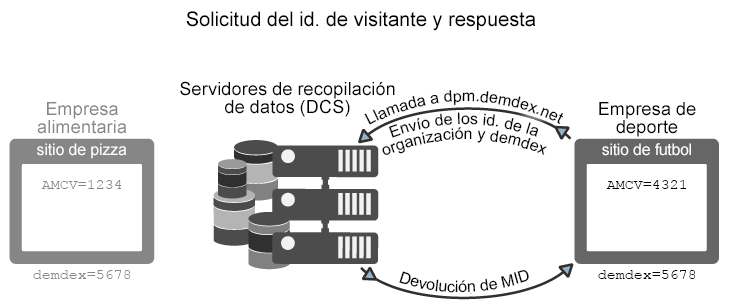

# Solicitud y configuración de ID con el servicio de ID de visitante de Adobe{#how-the-experience-cloud-id-service-requests-and-sets-ids}

Información general sobre el proceso de solicitud y respuesta de ID. Estos ejemplos abarcan la asignación de ID en sitios individuales, entre sitios diferentes y para sitios administrados por clientes de CX Enterprise diferentes con sus propios ID de organización de IMS.

>[!NOTE]
>
>Si no conoce cómo el servicio de identificación del visitante crea la identificación del visitante, dedique unos minutos a revisar [Cookies y el servicio de identificación del visitante](../introduction/cookies.md).

## Solicitud de un ECID {#section-0b5e261fbd0547d9b9a1680e5ce536cc}

Los siguientes ejemplos muestran cómo el servicio de ID de visitante solicita y recibe el ECID. Estos ejemplos usan dos empresas ficticias, la Empresa alimentaria y la Empresa de deporte, para mostrar los flujos de datos para las solicitudes de ID y las respuestas. Cada empresa tiene un ID de organización de IMS único y ha implementado el código del servicio de ID de visitante en todos sus sitios. Estos casos de uso representan flujos de datos para una implementación genérica del servicio de ID de visitante sin Analytics, ID heredados o exploradores que bloquean cookies de terceros.

**Primera solicitud**

En este ejemplo, un nuevo visitante llega al sitio de pizzas administrado por Food Company. Food Company tiene un código de servicio de ID de visitante en el sitio web de pizzas. Cuando se carga el sitio de pizzas, el código del servicio de ID de visitante comprueba la cookie AMCV en el dominio de pizzas.

* Si se establece la cookie AMCV, el visitante del sitio tiene un ECID. En este caso, la cookie rastrea al visitante y comparte datos con otras soluciones de CX Enterprise.
* Si no se establece la cookie AMCV, el código del servicio de ID de visitante llama a un [servidor de recopilación de datos](https://experienceleague.adobe.com/docs/analytics/technotes/rdc/regional-data-collection.html?lang=es) (DCS) regional en `dpm.demdex.net/id` (consulte también [Explicación de las llamadas al dominio Demdex](https://experienceleague.adobe.com/docs/audience-manager/user-guide/reference/demdex-calls.html?lang=es). La llamada incluye el ID de organización de IMS para Food Company. El identificador de organización de IMS se establece en la función `Visitor.getInstance` del código del servicio de ID de visitante.

**Primera respuesta**

En la respuesta, el DCS devuelve el ECID y la cookie demdex. El código del servicio de ID de visitante escribe el valor MID en la cookie AMCV. Por ejemplo, supongamos que el DCS devuelve un valor MID de 1234. La cookie AMCV se almacenaría como `mid|1234` y se establecería en el dominio de pizzas de origen. La cookie demdex también contiene un ID único (llamémoslo 5678). Esta cookie se establece en el dominio demdex.net de terceros, que es independiente del dominio de pizzas.

Como verá en el siguiente ejemplo, el ID de demdex y el ID de organización de IMS permiten al servicio de ID de visitante crear y devolver el MID correcto cuando nuestro visitante se desplace a otro sitio que pertenece a Food Company.

## Solicitud y respuesta entre sitios {#section-15ea880453af467abd2874b8b4ed6ee9}

En este ejemplo, nuestro visitante de Food Company navega al sitio de tacos desde el sitio de pizzas. Food Company tiene un código de servicio de ID de visitante en el sitio web de tacos. El visitante nunca ha estado en el sitio web de tacos.

Dadas estas condiciones, no hay ninguna cookie AMCV en el sitio de tacos. Además, el servicio de ID de visitante no puede usar la cookie AMCV establecida en el sitio de pizzas porque es específica del dominio de pizzas. Como resultado, el servicio de ID de visitante debe llamar al DCS para buscar y solicitar un ID de visitante. En este caso, la llamada del DCS incluye el identificador de organización de IMS *de Food Company y* el identificador de demdex. Recuerde que el ID de demdex se recoge del sitio de pizzas y se almacena como una cookie de terceros bajo el dominio demdex.net.

Una vez que el DCS recibe el ID de organización de IMS y el ID de demdex, crea y devuelve el MID correcto para el visitante del sitio. Dado que el MID se deriva matemáticamente del ID de organización de IMS y del ID de demdex, la cookie AMCV contiene el valor de MID, `mid = 1234`.

## Solicitudes de ID de otros sitios {#section-ba9a929e50d64b0aba080630fd83b6f1}

En este ejemplo, nuestro visitante deja los sitios de Food Company y navega al sitio de fútbol propiedad de Sports Company. Cuando el visitante llega al sitio de fútbol, el proceso de verificación y solicitud de ID funciona del mismo modo que en los ejemplos anteriores. Sin embargo, como Sports Company tiene su propio ID de organización de IMS, el servicio de ID de visitante devuelve un MID diferente. El nuevo MID es exclusivo de los dominios controlados por la Empresa de deporte y permite que esta empresa realice un seguimiento de los datos de los visitantes y los comparta con otras soluciones de CX Enterprise. El ID de demdex sigue siendo el mismo para este visitante, ya que está contenido en una cookie de terceros y se mantiene entre dominios distintos.

