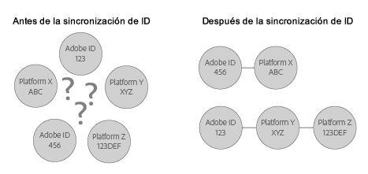

# Conceptos básicos de sincronización de ID y tasas de coincidencia{#understanding-id-synchronization-and-match-rates}

Información general sobre procesos de sincronización de ID y tasas de coincidencia en el servicio de identidad de Experience Platform, incluido Adobe Media Optimizer y el servicio de ID.

## Tasas de coincidencia y sincronización de ID {#section-f652aae7234945e89d26dd833c5215fb}

La sincronización de ID hace coincidir los ID que ha asignado el servicio de ID a los identificadores que nuestros clientes han asignado a los visitantes del sitio. Por ejemplo, supongamos que el servicio de ID ha asignado el ID 1234 a un visitante. Otra plataforma conoce a este visitante mediante el ID 4321. El servicio de ID unifica estos ID durante el proceso de sincronización. Los resultados agregan nuevos puntos de datos a lo que nuestros clientes conocen sobre los visitantes de su sitio. Y, si el servicio de ID no puede hacer coincidir un ID, crea uno nuevo que usará para realizar la sincronización en el futuro.

Las tasas de coincidencia miden y validan la eficacia del proceso de sincronización de ID. Una tasa de coincidencia elevada sugiere que un servicio concreto resultará más eficaz y permitirá acceder a una audiencia en línea más amplia que un servicio con una tasa de coincidencia baja. Poder comparar tasas de coincidencia es una manera cuantificable de evaluar diferentes plataformas tecnológicas de publicidad integradas.



**Garantizar tasas de coincidencia elevadas**

Para generar tasas de coincidencia elevadas, es importante configurar correctamente el servicio de ID (consulte la guía de implementación [estándar](../implementation-guides/standard.md#concept-89cd0199a9634fc48644f2d61e3d2445)). Una buena implementación ayuda a garantizar tasas de coincidencia elevadas, ya que permite al servicio de ID definir las cookies necesarias para dar funcionalidad a los ID y sincronizarlos con los socios de datos habilitados. No obstante, factores como una conexión a Internet lenta, una recopilación de datos desde dispositivos móviles o redes inalámbricas, pueden afectar a la calidad de la recopilación, sincronización y coincidencia de identificadores por parte del servicio de ID. Estas variables del lado de cliente escapan al control del servicio de ID o de [!DNL Adobe].

## Proceso de sincronización de ID descrito {#section-a541a85cbbc74f5682824b1a2ee2a657}

El servicio de ID sincroniza los identificadores en tiempo real. Este proceso tiene lugar en el navegador, en lugar de mediante transferencia de datos de servidor a servidor. En la tabla siguientes se describen los pasos del proceso de sincronización de ID.

**Paso 1: Cargar página**

Cuando un visitante llega a su sitio y carga una página, la `Visitor.getInstance` función realiza una [llamada CORS](../reference/cors.md#concept-6c280446990d46d88ba9da15d2dcc758) o JSON-P al servicio de ID. El servicio de ID responde con una cookie que incluye el ID de [!DNL Experience Cloud] (MID) del visitante. El MID es un identificador único que se asigna a cada visitante del sitio. Consulte también [Cookies y el servicio de identidad de Experience Platform](../introduction/cookies.md).

**Paso 2: Carga del iframe**

Mientras el cuerpo de la página se está cargando, el servicio de ID carga un iframe, el cual se denomina *`Destination Publishing iFrame`*. [!DNL Destination Publishing iFrame] Las cargas en un dominio se separan de la página principal. Este diseño ayuda a garantizar el funcionamiento de la página y mejora la seguridad debido al siguiente comportamiento del iframe:

* Se carga de manera asíncrona en relación con la página principal. Esto significa que la página principal puede cargarse [!DNL Destination Publishing iFrame]de forma independiente. Al cargarse el iframe y cargarse los píxeles de sincronización de ID desde dentro del iframe, la página principal no se verá afectada, como tampoco lo hará la experiencia del usuario.
* Se carga lo más rápido posible. Si esto sucede con demasiada rapidez, puede cargar el iframe después del evento de carga de ventana (no recomendado). Consulte [idSyncAttachIframeOnWindowLoad](../library/function-vars/idsyncattachiframeonwindowload.md#reference-b86b7112e0814a4c82c4e24c158508f4) para obtener información detallada.
* Impide que el código dentro del iframe obtenga acceso a la página principal, o produzca algún efecto en ella.

Consulte también [How the Experience Platform Identity Service Requests and Sets IDs…](../introduction/id-request.md#concept-2caacebb1d244402816760e9b8bcef6a)

**Paso 3: Activación de la sincronización de los ID**

La sincronización de ID se produce mediante una URL que activa el iframe de publicación de destino. Tal y como se puede ver en este ejemplo genérico, la URL de sincronización de ID contiene un extremo de sincronización de ID de socio y una URL de redireccionamiento, que redirige de nuevo a [!DNL Adobe] y que incluye su ID.

```
http://abc.com?partner_id=abc&sync_id=123&redir=http://dpm.demdex.net/ibs:dpid=<
<varname>
  ADOBE_PARTNER_ID
</varname>>&dpuuid=<
<varname>
  PARTNER_UUID
</varname>>
```

Consulte también [Sincronización de ID para transferencias de datos entrantes](https://marketing.adobe.com/resources/help/en_US/aam/c_id_sync_in.html).

**Paso 4: Almacenamiento de los ID**

Los ID sincronizados se almacenan en los [servidores de datos principales y perimetrales](https://marketing.adobe.com/resources/help/en_US/aam/c_compedge.html).

## Los servicios de sincronización administran la sincronización de ID {#section-cd5784d7ad404a24aa28ad4816a0119a}

El término *`Sync Services`* hace referencia a [!DNL Experience Cloud] tecnologías internas responsables de la sincronización de ID. Este servicio está habilitado de manera predeterminada. Para deshabilitarlo, agregue una [variable opcional](../library/function-vars/disableidsync.md#reference-589d6b489ac64eddb5a7ff758945e414) a la función `Visitor.getInstance` del servicio de ID. Los servicios de sincronización coinciden con [!DNL Experience Cloud] diferentes ID, como:

* ID [!DNL Experience Cloud] de cookies de terceros con [!DNL Experience Cloud] ID de origen.

* ID [!DNL Experience Cloud] de cookies de origen ( [!DNL Adobe Media Optimizer] AMO).

* ID de cookies de terceros de [!DNL Experience Cloud] con ID de plataformas de segmentación y otros proveedores de datos. Esto incluye servicios y plataformas como proveedores de datos, plataformas del lado de la demanda o el suministro, redes de anuncios, intercambios, etc.
* ID [!DNL Experience Cloud] de cookies individuales con ID de socios entre dispositivos.

## Sincronización de ID con Adobe Media Optimizer {#section-642c885ea65d45ffb761f78838735016}

[!DNL Adobe Media Optimizer] es una excepción al proceso de sincronización de ID basado en iframes. Debido a [!DNL Media Optimizer] que es un dominio de confianza, se producen sincronizaciones de ID desde la página principal en lugar de desde [!DNL Destination Publishing iFrame]la. Durante la sincronización, el servicio de ID llama [!DNL Media Optimizer] a, `cm.eversttech.net`que es un nombre de dominio heredado utilizado [!DNL Media Optimizer] por Adobe antes de su adquisición. El envío de datos a [!DNL Media Optimizer] ayuda a mejorar las tasas de coincidencia y se realiza automáticamente para los clientes de servicio de ID que utilizan la versión 2.0 (o posterior). Consulte también [Cookies de Media Optimizer](https://marketing.adobe.com/resources/help/en_US/whitepapers/cookies/cookies_media_optimizer.html).

>[!MORE_ LIKE_ THIS]
>
>* [Explicación de las llamadas al dominio Demdex](https://marketing.adobe.com/resources/help/en_US/aam/demdex-calls.html)

