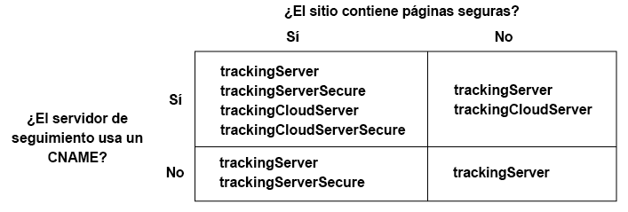

# Implementación del servicio Experience Cloud ID para Analytics y Audience Manager{#implement-the-experience-cloud-id-service-for-analytics-and-audience-manager}

Estas instrucciones están destinadas a los clientes de Analytics y Audience Manager que desean utilizar el servicio Experience Cloud ID y no utilizan Dynamic Tag Management (DTM). No obstante, le recomendamos encarecidamente que utilice DTM para implementar el servicio de ID. DTM racionaliza el flujo de trabajo de implementación y garantiza la colocación y secuencia correcta del código automáticamente.

>[!IMPORTANT]
>
>* [Lea los requisitos](../mcvid-reference/mcvid-requirements.md) antes de comenzar.
>* Este procedimiento requiere AppMeasurement. Los clientes que usen s_code no podrán completar este procedimiento.
>* Configure y pruebe este código en un entorno de desarrollo antes de implementarlo en producción.
>


## Paso 1: Planificar el reenvío del lado del servidor {#section-880797cc992d4755b29cada7b831f1fc}

Además de los pasos descritos aquí, los clientes que usan [!DNL Analytics] y [!DNL Audience Manager] deben migrar al reenvío del lado de servidor. El reenvío del lado de servidor permite eliminar el código DIL (el código de recopilación de datos de Audience Manager) y sustituirlo por el [módulo Gestión de público](https://marketing.adobe.com/resources/help/en_US/aam/c_profiles_audiences.html). Consulte la [documentación de reenvío del lado de servidor](https://marketing.adobe.com/resources/help/en_US/analytics/audiences/ssf.html) para obtener más información.

Migrar al reenvío del lado de servidor requiere planificación y coordinación. Este proceso conlleva realizar cambios externos en el código del sitio, así como determinados pasos internos que Adobe debe implementar para aprovisionar su cuenta. De hecho, muchos de estos procedimientos de migración han de suceder en paralelo e implementarse al mismo tiempo. Su ruta de implementación deberá seguir esta secuencia de eventos:

1. Trabaje con sus contactos de [!DNL Analytics] y [!DNL Audience Manager] para planificar el servicio de ID y la migración de reenvío del lado de servidor. Haga que la selección de un servidor de seguimiento conforme una parte importante de este plan.

1. Se aprovisiona para [!DNL Profiles & Audiences]. Complete el formulario en el [sitio de aprovisionamiento e integraciones](https://adobe.allegiancetech.com/cgi-bin/qwebcorporate.dll?idx=X8SVES) para ponerse en marcha.

1. Implemente el servicio de ID y el [!DNL Audience Management Module] mismo. Para poder funcionar correctamente, [!DNL Audience Management Module] el (reenvío de servidor) y el servicio de ID deben lanzarse para el mismo conjunto de páginas y al mismo tiempo.

## Paso 2: Descargar el código del servicio de ID {#section-0780126cf43e4ad9b6fc5fe17bb3ef86}

El servicio de ID requiere la biblioteca de códigos `VisitorAPI.js`. Para descargar esta biblioteca de códigos:

1. Vaya a **[!UICONTROL Administración]** &gt; **[!UICONTROL Administrador de códigos]**.

1. En Administrador de códigos, haga clic en **[!UICONTROL JavaScript (nuevo)]** o **[!UICONTROL JavaScript (heredado)]**. Se descargarán las bibliotecas de códigos comprimidas.

1. Descomprima el archivo de códigos y abra el archivo `VisitorAPI.js`.

## Paso 3: Agregar la función Visitor. getinstance al código del servicio de ID {#section-9e30838b4d0741658a7a492153c49f27}

>[!IMPORTANT]
>
>* Las versiones anteriores de la API del servicio de ID ubicaban esta función en un lugar distinto y requerían una sintaxis diferente. Si va a migrar desde una versión anterior a la [versión 1.4](../mcvid-release-notes/mcvid-notes-2015.md#section-f5c596f355b14da28f45c798df513572), anote la nueva ubicación y la sintaxis documentadas aquí.
>* El código que aparece TODO EN MAYÚSCULAS funciona como marcador de posición para valores reales. Sustituya este texto por el ID de su organización, la URL del servidor de seguimiento u otro valor con nombre.
>


**Parte 1: Copia de la función Visitor.getInstance a continuación**

```js
var visitor = Visitor.getInstance("INSERT-MARKETING-CLOUD-ORGANIZATION ID-HERE", { 
     trackingServer: "INSERT-TRACKING-SERVER-HERE", // same as s.trackingServer 
     trackingServerSecure: "INSERT-SECURE-TRACKING-SERVER-HERE", // same as s.trackingServerSecure 
 
     // To enable CNAME support, add the following configuration variables 
     // If you are not using CNAME, DO NOT include these variables 
     marketingCloudServer: "INSERT-TRACKING-SERVER-HERE", 
     marketingCloudServerSecure: "INSERT-SECURE-TRACKING-SERVER-HERE" // same as s.trackingServerSecure 
}); 
```

**Parte 2: Adición del código de función al archivo VisitorAPI.js**

Coloque la función `Visitor.getInstance` al final del archivo, después del bloque de códigos. El archivo editado debería tener un aspecto similar a este:

```js
/* 
========== DO NOT ALTER ANYTHING BELOW THIS LINE ========== 
Version and copyright section 
*/ 
 
// Visitor API code library section 
 
// Put Visitor.getInstance at the end of the file, after the code library 
 
var visitor = Visitor.getInstance("INSERT-MARKETING-CLOUD-ORGANIZATION ID-HERE", { 
     trackingServer: "INSERT-TRACKING-SERVER-HERE", // same as s.trackingServer 
     trackingServerSecure: "INSERT-SECURE-TRACKING-SERVER-HERE", // same as s.trackingServerSecure 
 
     // To enable CNAME support, add the following configuration variables 
     // If you are not using CNAME, DO NOT include these variables 
     marketingCloudServer: "INSERT-TRACKING-SERVER-HERE", 
     marketingCloudServerSecure: "INSERT-SECURE-TRACKING-SERVER-HERE" // same as s.trackingServerSecure 
}); 
```

## Paso 4: Add your Experience Cloud Organization ID to Visitor. getinstance {#section-e2947313492546789b0c3b2fc3e897d8}

En la `Visitor.getInstance` función, sustituya `INSERT-MARKETING-CLOUD-ORGANIZATION ID-HERE` por su ID de organización de Experience Cloud. Si no conoce su ID de organización, puede encontrarlo en la página de administración de Experience Cloud. Su función editada podría tener un aspecto similar al ejemplo siguiente.

`var visitor = Visitor.getInstance("1234567ABC@AdobeOrg", { ...`

>[!IMPORTANT]
>
>*No* cambie el caso de los caracteres del identificador de organización. El ID distingue entre mayúsculas y minúsculas y debe escribirse exactamente como se facilita.

## Paso 5: Adición de los servidores de seguimiento a Visitor. getinstance {#section-0dfc52096ac2427f86045aab9a0e0dfc}

Analytics utiliza servidores de seguimiento para recopilar datos.

**Parte 1: Búsqueda de las URL de su servidor de seguimiento**

Consulte los `s_code.js` archivos o `AppMeasurement.js` las URL para encontrar las URL del servidor de seguimiento. Buscará las URL especificadas por estas variables:

* `s.trackingServer`
* `s.trackingServerSecure`

**Parte 2: Establecimiento de variables del servidor de seguimiento**

Para determinar las variables del servidor de seguimiento que se van a emplear:

1. Responda las preguntas de la matriz de decisión siguiente. Use las variables que se correspondan con las respuestas.
1. Sustituya los marcadores del servidor de seguimiento por las URL de su servidor de seguimiento.
1. Elimine las variables del servidor de seguimiento y del servidor de Experience Cloud no utilizadas del código.



>[!NOTE]
>
>Cuando se utilice, combine las URL del servidor de Experience Cloud con las URL de su servidor de seguimiento correspondiente de este modo:

* URL del servidor de Experience Cloud = URL del servidor de seguimiento
* URL segura del servidor de Experience Cloud = URL segura del servidor de seguimiento

Si no está seguro de cómo encontrar su servidor de seguimiento, consulte las [Preguntas más frecuentes](../mcvid-faq-intro/ecid-faq.md) y [Rellenar correctamente las variables trackingServer y trackingServerSecure](https://helpx.adobe.com/analytics/kb/determining-data-center.html#). 

## Paso 6: Actualizar el archivo appmeasurement. js {#section-5517e94a09bc44dfb492ebca14b43048}

Este paso requiere [!DNL AppMeasurement]. No podrá continuar si aún utiliza s_code.

Agregue `Visitor.getInstance` la siguiente función a su `AppMeasurement.js` archivo. Colóquela en la sección que contiene configuraciones como `linkInternalFilters`, `charSet``trackDownloads`etc.:

`s.visitor = Visitor.getInstance("INSERT-MARKETING-CLOUD-ORGANIZATION ID-HERE");`

>[!IMPORTANT]
>
>En este punto, debe eliminar el código [!DNL Audience Manager] DIL y sustituirlo por el módulo Gestión de público. Consulte las instrucciones en [Implementar el reenvío del lado de servidor](https://marketing.adobe.com/resources/help/en_US/reference/ssf.html).

***(Opcional, pero recomendada)*Crear una variable prop personalizada**

Establezca una prop personalizada en `AppMeasurement.js` para medir la cobertura. Agregue esta variable prop personalizada a la función `doPlugins` de su archivo `AppMeasurement.js`:

```js
// prop1 is used as an example only. Choose any available prop. 
s.prop1 = (typeof(Visitor) != "undefined" ? "VisitorAPI Present" : "VisitorAPI Missing");
```

## Paso 7: Agregar código de API de visitante a la página {#section-c2bd096a3e484872a72967b6468d3673}

Coloque ` [!DNL VisitorAPI.js]` el archivo dentro de `<head>` las etiquetas en cada página. Cuando coloque el archivo `VisitorAPI.js` en su página:

* Colóquelo al principio de `<head>` la sección para que aparezca antes que otras etiquetas de soluciones.
* Debe ejecutarse antes de AppMeasurement y el código de otras soluciones de [!DNL Experience Cloud].

## Paso 8: (Opcional) Configure un período de gracia {#section-aceacdb7d5794f25ac6ff46f82e148e1}

Si alguno de estos casos de uso se aplica a su situación, pida [al Servicio](https://helpx.adobe.com/marketing-cloud/contact-support.html) de atención al cliente que configure un período [de gracia temporal](../mcvid-reference/mcvid-analytics-reference/mcvid-grace-period.md). Los períodos de gracia pueden prolongarse hasta 180 días. Si es necesario, puede renovar un período de gracia.

**Implementación parcial**

Necesita un período de gracia si hay páginas que usan el servicio de ID y otras no, y si todas envían su informe al mismo grupo de informes de Analytics. Esta suele ser la situación habitual cuando se tiene un grupo de informes global que reporta entre dominios.

Interrumpa el período de gracia una vez que se haya implementado el servicio de ID en todas las páginas web que reportan al mismo grupo de informes.

**Requisitos de la cookie s_vi**

Necesita un período de gracia si necesita que nuevos visitantes tengan una cookie s_vi después de migrar al servicio de ID. Esto es lo habitual si su implementación lee la cookie s_vi y la almacena en una variable.

Interrumpa el período de gracia cuando su implementación pueda capturar el MID en lugar de leer la cookie s_vi.

Consulte también [Cookies y el servicio Experience Cloud ID](../mcvid-introduction/mcvid-cookies.md).

**Integración de flujo de navegación**

Necesita un período de gracia si envía datos a un sistema interno desde una fuente de datos de flujo de navegación y si sus procesos utilizan las columnas `visid_high` y `visid_low`.

Interrumpa el período de gracia después de que el proceso de inserción de datos pueda utilizar las columnas `post_visid_high` y `post_visid_low` las columnas.

Consulte también [Referencia de columnas de datos del flujo de navegación](https://marketing.adobe.com/resources/help/en_US/sc/clickstream/datafeeds_reference.html).

## Paso 9: Probar e implementar el código del servicio de ID {#section-f857542bfc70496dbb9f318d6b3ae110}

Puede probar e implementar de la siguiente manera.

**Probar y verificar**

Para probar la implementación del servicio de ID, compruebe:

* [La cookie de AMCV](../mcvid-introduction/mcvid-cookies.md) en el dominio en el que está alojada su página.
* El valor MID en la solicitud de imagen de Analytics con la [herramienta de depuración de Adobe](https://marketing.adobe.com/resources/help/en_US/sc/implement/debugger.html).
* Consulte también [Prueba y verificación del servicio Experience Cloud ID](../mcvid-implementation-guides/mcvid-test-verify.md).

Para verificar el reenvío del lado del servidor, vea [Cómo verificar la implementación del reenvío del lado del servidor](https://marketing.adobe.com/resources/help/en_US/reference/ssf-verify.html)

**Implementación**

Implementación del código una vez pasada la prueba.

Si ha habilitado un período de gracia:

* Asegúrese de que el ID de Analytics (AID) y el MID estén en la solicitud de imagen.
* Recuerde deshabilitar el período de gracia cuando se cumplan los criterios para ello.

