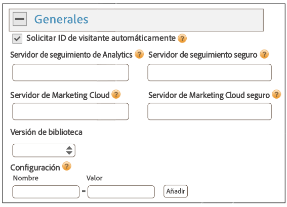
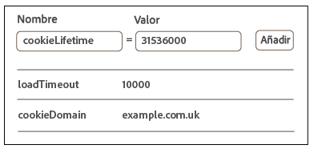
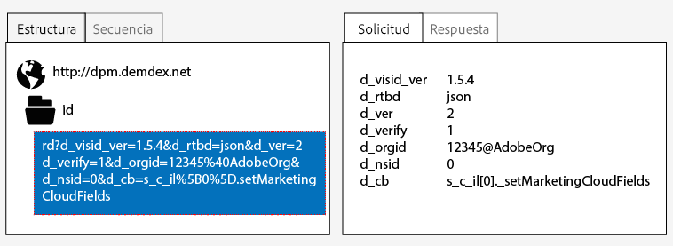
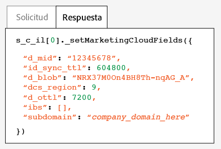
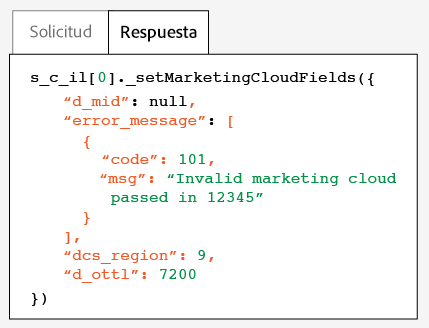

# Implementación con la administración dinámica de etiquetas{#implementation-with-dynamic-tag-management}

Las implementaciones más antiguas utilizan Dynamic Tag Management (DTM) para configurar, implementar e integrar el servicio Experience Cloud ID con el resto de las soluciones de Experience Cloud.

## Implementación con la administración dinámica de etiquetas {#topic-6f4ed5d96977406ca991e50f3fbd5b01}

Las implementaciones más antiguas utilizan Dynamic Tag Management (DTM) para configurar, implementar e integrar el servicio Experience Cloud ID con el resto de las soluciones de Experience Cloud.

>[!NOTE]
>
>Actualmente [, Launch, de Adobe](https://docs.adobelaunch.com/) es la herramienta de implementación preferida y recomendada, ya que ayuda a simplificar tareas complejas de administración de etiquetas y automatiza la ubicación de código más allá de las capacidades de DTM. Consulte [Implementación con Launch](../mcvid-implementation-guides/ecid-implement-with-launch.md).

## Dynamic Tag Management y el servicio de ID {#section-4a4c4fac5d0a4cbbaff8e1833f73657c}

[La administración](https://marketing.adobe.com/resources/help/en_US/dtm/) dinámica de etiquetas permite configurar, implementar y gestionar su instancia de servicio de ID y integraciones [!DNL Experience Cloud] de solución relacionadas. DTM ayuda a simplificar el proceso de implementación, ya que está profundamente integrado con el servicio de ID y con otras soluciones de Experience Cloud. Simplemente agregue y configure la herramienta de Experience Cloud ID, y especifique la información oportuna, como:

* ID de organización de Experience Cloud (se rellena automáticamente si se vincula con Experience Cloud)
* Servidor de seguimiento de Analytics (seguro y no seguro)
* Servidor de Experience Cloud (para servidores de seguimiento propios)

Todos los clientes de [!DNL Experience Cloud] pueden disponer gratuitamente de DTM.

**Introducción a DTM**

DTM es una herramienta sencilla pero potente. Si aún no la usa, le recomendamos encarecidamente que lo haga. Consulte la [documentación](https://marketing.adobe.com/resources/help/en_US/dtm/c_overview.html) de DTM y los [vídeos de iniciación rápida para DTM](https://marketing.adobe.com/resources/help/en_US/dtm/jump-start-videos.html) para poner en marcha este servicio. Para ver instrucciones sobre cómo configurar el servicio de ID con DTM, consulte la información y los procedimientos que se describen en las secciones a continuación.

## Directrices para la implementación {#concept-54a2ec49af8f4bfca9207b1d404e8e1a}

Lea estos requisitos y procedimientos antes de intentar implementar el servicio Experience Cloud ID con Dynamic Tag Management (DTM).

<!--
mcvid-dtm-deployment.xml
-->

**Aprovisionar su cuenta**

Antes de empezar, asegúrese de que su organización y soluciones estén aprovisionadas para el [!DNL Experience Cloud] y que usted conoce [!DNL Dyanamic Tag Management]. Esta documentación puede ayudarle a empezar:

* [Habilite las soluciones para los servicios principales](https://marketing.adobe.com/resources/help/en_US/mcloud/core_services.html): Implemente Experience Cloud y conviértase en administrador. Este proceso moderniza las soluciones para servicios principales como los atributos del cliente y las audiencias de Experience Cloud.
* [Introducción a Dynamic Tag Management](https://marketing.adobe.com/resources/help/en_US/dtm/get_started.html)
* [Vídeos](https://marketing.adobe.com/resources/help/en_US/dtm/jump-start-videos.html)de iniciación: Una serie de breves vídeos que muestran cómo realizar tareas básicas de DTM.

**Colocación del código del servicio de ID y orden de carga**

El servicio de ID funciona por medio de la solicitud y la recepción de un ID único desde los servidores de recopilación de datos de [!DNL Adobe]. Para poder funcionar correctamente, su código de servicio de ID debe:

* ser el primer bloque de código de [!DNL Adobe] que se ejecute en la página;
* Se coloca lo más alto posible en la página, normalmente dentro del bloque `<head>` de código.

Siempre que mantenga todas sus soluciones de [!DNL Adobe] y sus bibliotecas de código en DTM, podrá estar seguro de que el código del servicio de ID se colocará en la ubicación adecuada y se activará en el momento oportuno.

**Validación de la recopilación de datos regionales**

Los clientes deben proporcionar un CNAME o usar [!DNL *.sc.omtrdc] para [la recopilación de datos regionales](https://marketing.adobe.com/resources/help/en_US/whitepapers/rdc/) (RDC). Solicite la configuración RDC específica a su consultor de [!DNL Adobe].

**Configurar grupos de informes de Analytics**

Los clientes nuevos de [!DNL Analytics] deberán [crear un grupo de informes](https://marketing.adobe.com/resources/help/en_US/reference/new_report_suite.html) para recopilar datos.

## Implementación del servicio Experience Cloud ID con DTM {#task-a659cf19dea84ad48edabe0b72ef9f5c}

Siga estos pasos para implementar el servicio de ID con Dynamic Tag Management (DTM).

**Requisitos previos**

* Habilite sus soluciones para [!DNL Experience Cloud] y verifique que dispone de permisos de administrador. Consulte [Activación de las soluciones para los servicios principales](https://marketing.adobe.com/resources/help/en_US/mcloud/core_services.html).

* Cree una propiedad web en DTM. Consulte en la documentación de DTM la sección sobre [cómo crear una propiedad web](https://marketing.adobe.com/resources/help/en_US/dtm/web_property.html) o el vídeo de [iniciación rápida para administradores](https://marketing.adobe.com/resources/help/en_US/dtm/admin-jump-start.html).

<!--
mcvid-dtm-implement.xml
-->

**Pasos de implementación** Para implementar el servicio de ID con DTM:

1. En la DTM [!DNL Dashboard], haga clic en la propiedad web con la que desee trabajar.
1. En la ficha **[!UICONTROL Información general]** de la propiedad web seleccionada, haga clic **[!UICONTROL en Agregar una herramienta]**.
1. En la lista **[!UICONTROL Tipo]** de herramienta, haga clic **[!UICONTROL en Servicio Experience Cloud ID]**.

   >[!NOTE]
   >
   >Esta acción rellena el cuadro ID de organización **[!UICONTROL de Experience Cloud]** con su identificador de organización. Si su cuenta de DTM no está vinculada a [!DNL Experience Cloud], deberá proporcionar este ID. Para vincular su cuenta, consulte [Vinculación de cuentas en Experience Cloud](https://marketing.adobe.com/resources/help/en_US/mcloud/organizations.html). Consulte los [requisitos](../mcvid-reference/mcvid-requirements.md#section-a02f537129a64ffbb690d5738d360c26) para ver información sobre cómo localizar el ID de su organización.

1. Escriba el nombre del servidor de seguimiento en el cuadro **[!UICONTROL Servidor]** de seguimiento. Si no está seguro de cómo encontrar su servidor de seguimiento, consulte [las preguntas más frecuentes](../mcvid-faq-intro/ecid-faq.md) y [Rellenar correctamente las variables trackingserver y trackingserversecure](https://helpx.adobe.com/analytics/kb/determining-data-center.html#).
1. Haga clic en **[!UICONTROL Crear herramienta]** y **[!UICONTROL guarde los cambios]**.

   Tras la operación de guardar, el servicio de ID quedará configurado como una herramienta dentro de DTM. No obstante, aún no estará listo para usarse. Su herramienta de DTM todavía tendrá que pasar por el proceso de publicación/aprobación de DTM, y es posible que le interese configurar otros parámetros adicionales. Para obtener información acerca del proceso de aprobación de DTM, consulte el vídeo de [iniciación rápida en los conceptos básicos de usuario](https://marketing.adobe.com/resources/help/en_US/dtm/user-basics-jump-start.html). Para obtener información sobre los otros parámetros adicionales que se pueden agregar a DTM, consulte [Configuración del servicio Experience Cloud ID para DTM](../mcvid-implementation-guides/mcvid-standard.md#concept-fb6cb6a0e6cc4f10b92371f8671f6b59).

>[!MORE_ LIKE_ THIS]
>
>* [Propiedades web](https://marketing.adobe.com/resources/help/en_US/dtm/web_property.html)


## Configuración del servicio Experience Cloud ID para DTM {#concept-fb6cb6a0e6cc4f10b92371f8671f6b59}

Describe los campos [!DNL Organization ID]y [!DNL General][!DNL Customer Settings] los campos y cómo son utilizados por el servicio [!DNL Experience Cloud] de ID.

<!--
mcvid-dtm-settings.xml
-->

## ¿Cómo encuentro estos ajustes? {#section-c5b2d1c928944ae2b8565c1b182fe575}

Los ajustes de configuración estarán disponibles después de agregar y guardar el servicio de ID como herramienta dentro de Dynamic Tag Management (DTM). También puede acceder a estos ajustes haciendo clic en el icono de engranaje de la [!DNL Installed Tools] sección de la propiedad web de la DTM.


## ID de organización {#section-949b5a0d8af940558b04ff675cf53f77}

Este es el ID necesario y asociado a la empresa de [!DNL Experience Cloud] aprovisionada. Una organización es la entidad que habilita un administrador para configurar grupos y usuarios, y controlar el inicio de sesión único en [!DNL Experience Cloud]. El ID de organización es una cadena alfanumérica de 24 caracteres seguida de @AdobeOrg (que debe ir incluido). Los administradores de [!DNL Experience Cloud] podrán consultar este ID en [Experience Cloud &gt; Herramientas](https://marketing.adobe.com/resources/help/en_US/mcloud/admin_getting_started.html).


Consulte también [Cookies y el servicio Experience Cloud ID](../mcvid-introduction/mcvid-cookies.md).

## Configuración general {#section-071d358e40f84629a8901b893dd61392}

Estos ajustes le permiten especificar servidores de seguimiento y versiones de código, así como agregar otras variables.



La siguiente tabla enumera y define [!DNL General] la configuración.

**Solicitar ID de visitante automáticamente**

Cuando se selecciona, la administración dinámica de etiquetas llama automáticamente al `getMarketingCloudVisitorID()` método antes de cargar cualquiera de las soluciones de Adobe que utilizan el servicio Experience Cloud ID.

Consulte [getmarketingcloudvisitorid](../mcvid-library/mcvid-get-set/mcvid-getmcvid.md).

**Servidor de seguimiento de Analytics**

El nombre del servidor de seguimiento utilizado para la recopilación de datos de Analytics. Este es el dominio donde se escribe la solicitud de imagen y la cookie (p. ej., [!DNL http://site.omtrdc.net]).

Si no conoce las URL del servidor de seguimiento, compruebe sus archivos `s_code.js` o `AppMeasurement.js` archivos. La que le interesa es la URL que establece la variable `s.trackingServer`.

Consulte [trackingServer](https://marketing.adobe.com/resources/help/en_US/sc/implement/trackingServer.html) y [Rellenar correctamente la variable trackingServer y trackingServerSecure](https://helpx.adobe.com/analytics/kb/determining-data-center.html#).

**Servidor de seguimiento seguro**

El nombre del servidor de seguimiento seguro utilizado para la recopilación de datos de Analytics. Este es el dominio donde se escribe la solicitud de imagen y la cookie (p. ej., [!DNL https://site.omtrdc.net]).

Si no conoce las URL del servidor de seguimiento, compruebe sus archivos `s_code.js` o `AppMeasurement.js` archivos. La que le interesa es la URL que establece la variable `s.trackingServerSecure`.

Consulte [trackingServer](https://marketing.adobe.com/resources/help/en_US/sc/implement/trackingServer.html) y [Rellenar correctamente la variable trackingServer y trackingServerSecure](https://helpx.adobe.com/analytics/kb/determining-data-center.html#).

**Servidor de Experience Cloud**

Si su empresa utiliza la recopilación de datos de origen (CNAME) para usar cookies de origen en un contexto de terceros, introduzca el servidor de seguimiento aquí (p. ej., [!DNL http://metrics.company.com]).

**Servidor de Experience Cloud seguro**

Si su empresa utiliza la recopilación de datos de origen (CNAME) para usar cookies de origen en un contexto de terceros, introduzca el servidor de seguimiento aquí (p. ej., [!DNL https://metrics.company.com]).

**Versión de biblioteca**

Establece la versión de la biblioteca de código del servicio de ID (`VisitorAPI.js`) que desea utilizar. Estas opciones de menú no se pueden editar.

**Configuración**

Estos campos le permiten agregar [variables de función](../mcvid-library/mcvid-function-vars/mcvid-function-vars.md) como pares clave-valor. Haga clic en **[!UICONTROL Agregar]para agregar una variable o más a su implementación del servicio de ID.**



>[!IMPORTANT]
>
>Establezca la `cookieDomain` variable aquí. Necesaria para dominios de nivel superior y de múltiples partes, donde alguna de las dos últimas partes de la URL tiene más de dos caracteres. Consulte la documentación sobre variables de configuración cuyos vínculos aparecen más arriba.

## Configuración de cliente {#section-238d1272c1504d148fe38fb0ae5d71c2}

Campos adicionales que le permiten agregar un código de integración o un estado de autenticación.


**Código de integración**

Un código de integración es un ID único que proporciona el cliente. El código de integración debe contener el valor que se utilizó para [crear una fuente de datos](https://marketing.adobe.com/resources/help/en_US/aam/create-datasource.html) en [!DNL Audience Manager].

**Valor**

El valor debe ser un elemento de datos que contenga el ID de usuario. Los elementos de datos son buenos contenedores de valores dinámicos, como los ID de un sistema interno específico del cliente.

**Estado de autenticación**

Opciones que definen o identifican a los visitantes según su estado de autenticación (p. ej., si ha iniciado sesión o si la ha cerrado). Consulte [ID de cliente y estados de autenticación](../mcvid-reference/mcvid-authenticated-state.md).

## Probar y verificar el servicio Experience Cloud ID {#concept-644fdbef433b46ba9c0634ac95eaa680}

Estas instrucciones, herramientas y procedimientos le ayudan a determinar si el servicio de ID está funcionando correctamente. Estas pruebas se aplican al servicio de ID en general, así como a diferentes combinaciones de soluciones del servicio de ID y [!DNL Experience Cloud].

<!--
mcvid-test-verify.xml
-->

## Antes de empezar {#section-b1e76ad552ed4eb793b6e521a55127d4}

Información importante para saber antes de comenzar a probar y verificar el servicio de ID.

**Entornos del explorador**

Cuando vaya a realizar pruebas en una sesión de navegador normal, borre la caché de su navegador antes de cada prueba.

También puede probar el servicio de ID en una sesión de navegador anónima o de incógnito. En una sesión anónima no necesitará borrar las cookies del navegador ni la caché antes de cada prueba.

**Herramientas**

La [herramienta de depuración de Adobe](https://marketing.adobe.com/resources/help/en_US/sc/implement/debugger.html) y el [proxy HTTP Charles](https://www.charlesproxy.com/) pueden ayudarle a determinar si el servicio de ID se ha configurado para funcionar correctamente con Analytics. La información en esta sección se basa en los resultados devueltos por la herramienta de depuración de Adobe y Charles. No obstante, es libre de usar la herramienta o el depurador que más le convenga.

## Pruebas con la herramienta de depuración de Adobe {#section-861365abc24b498e925b3837ea81d469}

La integración de servicios se configura correctamente cuando se ve un [!DNL Experience Cloud ID] (MID) en la respuesta [!DNL Adobe] del depurador. Consulte [Cookies y el servicio Experience Cloud ID](../mcvid-introduction/mcvid-cookies.md) para obtener más información sobre el MID.

Para verificar el estado del servicio de ID con el [!DNL Adobe][depurador](https://marketing.adobe.com/resources/help/en_US/sc/implement/debugger.html):

1. Borre las cookies del navegador o abra una sesión de navegación anónima.
1. Cargue su página de prueba con el código del servicio de ID.
1. Abra el [!DNL Adobe] depurador.
1. Busque en los resultados un MID.

## Comprender los resultados de Adobe Debugger {#section-bd2caa6643d54d41a476d747b41e7e25}

El MID se almacena en un par clave-valor que utiliza esta sintaxis: `MID= *`Experience Cloud ID`*`. El depurador muestra esta información tal y como se ve a continuación.

**Correcto**

El servicio de ID se ha implementado correctamente si aparece una respuesta similar a esta:

```
mid=20265673158980419722735089753036633573
```

Si es cliente de [!DNL Analytics], es posible que vea un ID de [!DNL Analytics] (AID) además del MID. Esto sucede:

* Con algunos de los primeros visitantes que han llegado su sitio o que le han dedicado mucho tiempo a este.
* Si tiene un período de gracia habilitado.

**Error**

Póngase en contacto con el [Servicio de atención al cliente](https://helpx.adobe.com/marketing-cloud/contact-support.html) en los casos siguientes:

* El depurador no devuelve un MID.
* El depurador devuelve un mensaje de error que indica que no se ha proporcionado su ID de socio.

## Pruebas con el proxy HTTP Charles {#section-d9e91f24984146b2b527fe059d7c9355}

Para verificar el estado del servicio de ID con Charles:

1. Borre las cookies del navegador o abra una sesión de navegación anónima.
1. Inicie Charles.
1. Cargue su página de prueba con el código del servicio de ID.
1. Busque las llamadas de solicitud y respuesta y los datos que se describen a continuación.

## Comprender los resultados de Charles {#section-c10c3dc0bb9945cbaffcf6fec7082fab}

Consulte esta sección para ver información sobre dónde y qué buscar al usar Charles para supervisar las llamadas HTTP.

**Solicitudes de servicio de ID correctas en Charles**

El código del servicio de ID funciona correctamente cuando la función `Visitor.getInstance` realiza una llamada de JavaScript a `dpm.demdex.net`. Las respuestas correctas incluirán su [identificador de organización](../mcvid-reference/mcvid-requirements.md#section-a02f537129a64ffbb690d5738d360c26). El ID de organización se transfiere como par clave-valor que utiliza esta sintaxis: `d_orgid= *`ID de organización`*`. Busque las llamadas `dpm.demdex.net` de JavaScript y de JavaScript bajo [!DNL Structure] la ficha. Busque su identificador de organización en [!DNL Request] la ficha.



**Respuestas correctas del servicio de ID en Charles**

Su cuenta se ha aprovisionado correctamente para el servicio de ID cuando la respuesta de los [servidores de recopilación de datos](https://marketing.adobe.com/resources/help/en_US/aam/c_compcollect.html) (DCS) devuelve un MID. El MID se devuelve como par clave-valor que utiliza esta sintaxis: `d_mid: *`Visitor Experience Cloud ID`*`. Busque el MID en [!DNL Response] la ficha, como se muestra a continuación.



**Respuestas del servicio de ID fallidas en Charles**

Su cuenta no se ha aprovisionado correctamente si el MID no aparece en la respuesta de los DCS. Una respuesta fallida devuelve un código de error y un mensaje en [!DNL Response] la ficha, como se muestra a continuación. Póngase en contacto con el Servicio de atención al cliente si aparece este mensaje de error en la respuesta del DCS.



Para obtener más información sobre los códigos de error, consulte [Códigos, mensajes y ejemplos de error de DCS](https://marketing.adobe.com/resources/help/en_US/aam/dcs_error_codes.html).
