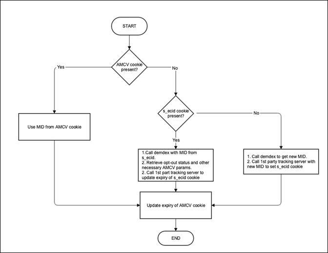

# Métodos de biblioteca ECID en un entorno de Safari ITP

>[!NOTE]
>
>Se han realizado actualizaciones para reflejar los últimos cambios en ITP que se lanzaron el 12 de noviembre de 2020 como parte de la versión Big Sur OS.

A medida que Safari aumenta el seguimiento entre dominios a través de ITP, Adobe debe mantener las prácticas recomendadas para bibliotecas que sean compatibles con los clientes, así como con la privacidad y con la opción del consumidor.

A partir del 10 de noviembre de 2020, todas las cookies persistentes de origen configuradas mediante la API de documento.cookie, a menudo conocidas como cookies de &quot;cliente&quot;, y las cookies configuradas mediante implementaciones de CNAME de origen en exploradores Safari e iOS móviles tienen un límite de caducidad de siete días. Las cookies de terceros seguirán bloqueadas, como se indica en versiones anteriores de ITP. Para obtener más información sobre ITP 2.1 y el impacto de las soluciones de Adobe, lea sobre [el impacto de Safari ITP 2.1 en Adobe Experience Cloud y en la plataforma de Experience Platform Customers](https://medium.com/adobetech/safari-itp-2-1-impact-on-adobe-experience-cloud-customers-9439cecb55ac).

## Cambios, métodos y configuraciones relacionados con ITP

A medida que se crean métodos adicionales para el seguimiento dentro de Safari, se agregarán como referencia a esta página.

>[!NOTE]
>
>*ECID* = *MID* = *MCID* en toda la documentación siguiente.

Consulte más abajo las iniciativas relacionadas con el uso de bibliotecas de ITP y ECID.

## Comportamiento actual de la biblioteca ECID con ITP y el WebKit de Apple

ITP 2.1 impide escribir cookies del lado del cliente, lo cual reduce la capacidad de proporcionar información exacta del seguimiento de visitantes a los clientes. Como tal, se está introduciendo un cambio en los servidores de seguimiento CNAME de Adobe para almacenar el ID de Experience Cloud (ECID) del visitante en una cookie de origen.

Este cambio solo es útil para clientes ECID que utilizan un CNAME de Analytics en un contexto propio. Si es cliente de Analytics que actualmente no utiliza un CNAME, o incluso un cliente que no sea de Analytics, podrá optar por un registro CNAME. Póngase en contacto con el Servicio de atención al cliente o con su representante de cuentas para iniciar el proceso de registro para un [CNAME](https://docs.adobe.com/content/help/es-ES/core-services/interface/ec-cookies/cookies-first-party.html).

Actualice a la biblioteca ECID versión 4.3.0 (o posterior) para aprovechar este cambio.

A continuación se describe cómo se comporta la biblioteca ECID con ITP 2.1 y los últimos cambios realizados por Apple como parte de la versión Big Sur

**Diseño**

Cuando se realiza una solicitud de ID a demdex.net y se recupera un ECID, si se configura un servidor de seguimiento en la biblioteca ECID, se realiza una solicitud de ID al dominio del cliente. Este extremo lee el parámetro ecid de la cadena de consulta y establece una nueva [cookie](/help/introduction/cookies.md) que incluye solo el ECID y una fecha de caducidad para dentro de dos años. Cada vez que se llama este extremo de esta manera, la cookie `s_ecid` se reescribe con una fecha de caducidad de dos años desde la hora de la llamada. La biblioteca ECID debe actualizarse a la versión 4.3.0 para poder recuperar el valor de esta cookie.

>[!IMPORTANT]
>
>Como parte de las actualizaciones de Big Sur, una `s_ecid` cookie configurada a través de CNAME también se conserva en un plazo de siete días.

Esta nueva cookie `s_ecid` sigue el mismo estado de exclusión que la cookie AMCV. Si se lee el ecid de la cookie `s_ecid`, siempre se llama inmediatamente a demdex para recuperar el estado de exclusión más reciente de ese ID y se almacena en la cookie AMCV.

Además, si el consumidor se ha excluido del seguimiento de Analytics mediante este [método](https://docs.adobe.com/content/help/es-ES/analytics/implementation/js/opt-out.html), se eliminará esta cookie `s_ecid`.

The tracking server name should be supplied to the VisitorJS library when initializing the library using `trackingServer` or `trackingServerSecure`. This should match the `trackingServer` config in the Analytics configs.

Si decide no aprovechar este método, agregue la siguiente configuración a su implementación de biblioteca ECID: `discardtrackingServerECID`. Cuando esta configuración se establece en true, la biblioteca de Visitante no lee el MID establecido por el servidor de seguimiento de origen.

## Utilice el método appendVisitorIDsTo para el seguimiento entre dominios (dentro de los múltiples dominios de la empresa)

Esta función le permite compartir un ECID de un visitante entre dominios cuando los navegadores bloquean las cookies de terceros. Para utilizar esta función, debe haber implementado el servicio de ID y ser el propietario de los dominios de origen y destino. Disponible en VisitorAPI.js en la versión 1.7.0 o superior (pero no en la versión 1.10.0).

**Diseño**

* Cuando un visitante navega a sus otros dominios, Visitor.appendVisitorIDsTo(url) devuelve una URL con ECID adjunta como parámetro de consulta.

   Utilice esta URL para redireccionar desde el dominio original al dominio de destino.

* Este código de servicio de ID en el dominio de destino extrae el ECID de la URL, en lugar de enviar una solicitud a Adobe para obtener el ID del visitante en cuestión.

   Esta solicitud incluye el ID de la cookie de terceros, que no está disponible en este caso.

* El código de servicio de ID en la página de destino emplea el ECID transferido para hacer un seguimiento del visitante.

   >[!NOTE]
   >Si la página de destino ya tiene un ECID de visitas anteriores, la decisión de sobrescribir la cookie existente está controlada por esta configuración overwriteCrossDomainMCIDAndAID. Para obtener más información sobre esta configuración, consulte [overwriteCrossDomainMCIDAndAID](/help/library/function-vars/overwrite-visitor-id.md).
   >
   >Para obtener más detalles sobre este método, consulte la página de referencia [appendVisitorIDsTo (Seguimiento entre dominios)](/help/library/get-set/appendvisitorid.md).
